# jykj_ocr 用户手册

本手册面向实际使用 jykj_ocr 的开发者与运维人员,分为两篇:

- **第一篇:部署篇** — 安装、配置、Docker、测试
- **第二篇:使用篇** — Python SDK 与 RESTful API 调用,含完整输入/输出格式与案例

---

# 第一篇 · 部署篇

## 1. 系统要求与架构概览

### 1.1 前置要求

- Python 3.10+
- 本地 OCR 无需任何外部服务或 API key
- 远程多模态 OCR 需要一个 OpenAI 兼容端点 + 对应 API key

### 1.2 系统架构

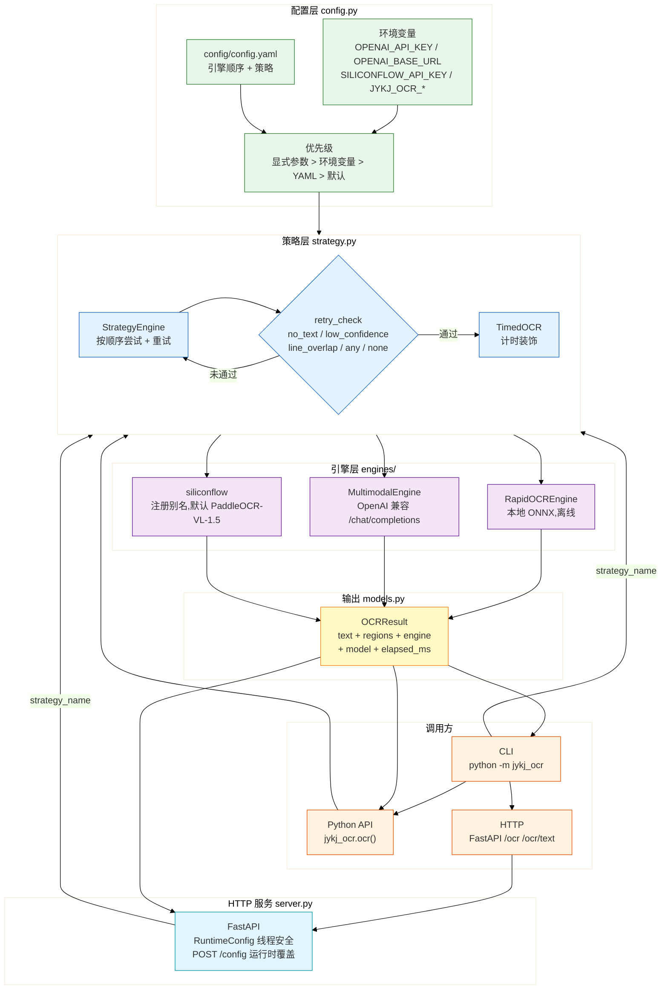

### 1.3 数据流(以一次 HTTP 请求为例)

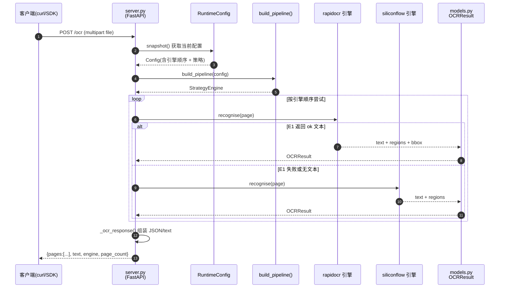

---

## 2. 安装

```bash
git clone <repo> jykj_ocr && cd jykj_ocr
python -m venv .venv
.venv/Scripts/activate          # Windows
# source .venv/bin/activate      # Linux/macOS
pip install -r requirements.txt
pip install -e .                 # 可选,注册 jykj-ocr 命令行入口
```

`requirements.txt` 自包含:核心运行依赖 + 测试依赖(`pytest`、`httpx`、`ruff`)。
`rapidocr-onnxruntime` 已列入其中,首次运行会自动下载模型权重。

验证安装:

```bash
python -m jykj_ocr --list-engines
# rapidocr       本地 RapidOCR(ONNX,离线)
# siliconflow    硅基流动多模态 OCR
# multimodal     通用 OpenAI 兼容端点
```

---

## 3. 配置

### 3.1 环境变量(远程引擎)

API key 永远只走环境变量,绝不写入代码或配置文件:

```bash
cp .env.example .env
# 编辑 .env:
#   OPENAI_API_KEY=sk-xxxxxxxx
#   OPENAI_BASE_URL=https://api.siliconflow.cn/v1
```

| 变量 | 必需 | 作用 |
|------|:----:|------|
| `OPENAI_API_KEY` | 远程引擎必需 | 通用 key,适配任意 OpenAI 兼容平台 |
| `OPENAI_BASE_URL` | multimodal 必需 | 端点 URL;siliconflow 不设时用内置默认 |
| `SILICONFLOW_API_KEY` | 可选 | 仅当 siliconflow 需与 `OPENAI_*` 不同 key 时覆盖 |
| `JYKJ_OCR_CONFIG` | 可选 | 配置文件路径(默认 `config/config.yaml`) |
| `JYKJ_OCR_PORT` | 可选 | HTTP 服务端口(默认 8000) |
| `JYKJ_OCR_REMOTE_ENGINES` | 可选 | 逗号分隔,把新引擎追加进远程名单(`vl` 侧),见 §9.2 |

切换平台示例(改两个变量即可,代码与配置文件不动):

| 平台 | `OPENAI_BASE_URL` |
|------|-------------------|
| 硅基流动 | `https://api.siliconflow.cn/v1` |
| 阿里云百炼 | `https://dashscope.aliyuncs.com/compatible-mode/v1` |
| 智谱 | `https://open.bigmodel.cn/api/paas/v4` |
| 本地 vLLM | `http://localhost:8000/v1` |

### 3.2 配置文件 `config/config.yaml`

定义引擎顺序、模型、策略:

```yaml
strategy:
  name: fallback             # local | vl | seq* | bestof* | fallback | quality(默认预设)
  max_retries: 1
  retry_mode: no_text        # no_text | low_confidence | line_overlap | any | none
  min_confidence: 0.7

engines:
  - name: rapidocr           # 本地,离线
    lang: ch
    enabled: true

  - name: siliconflow        # 硅基流动
    model: PaddlePaddle/PaddleOCR-VL-1.5
    base_url: https://api.siliconflow.cn/v1
    temperature: 0.0
    timeout: 180
    prompt: |
      请识别图片中的全部文字内容,按原文版面顺序输出。
      只输出文字,不要翻译、不要解释。

  - name: multimodal         # 通用 OpenAI 兼容(留空 base_url 走 OPENAI_BASE_URL)
    enabled: false
    model: qwen-vl-max
```

### 3.3 配置优先级

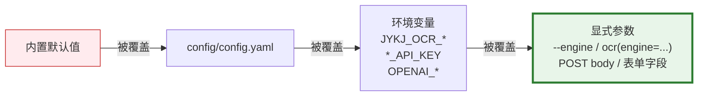

**口诀**:离用户最近的覆盖最远的。命令行参数 > 环境变量 > YAML 文件 > 代码默认值。

---

## 4. Docker 部署

```bash
# 构建并启动(含 healthcheck + 模型权重持久化)
docker compose up --build

# 单容器
docker build -t jykj_ocr .
docker run --rm -p 8000:8000 --env-file .env jykj_ocr

# 容器内一次性任务
docker run --rm --env-file .env -v "$PWD:/data" jykj_ocr \
    python -m jykj_ocr /data/scan.png --engine siliconflow
```

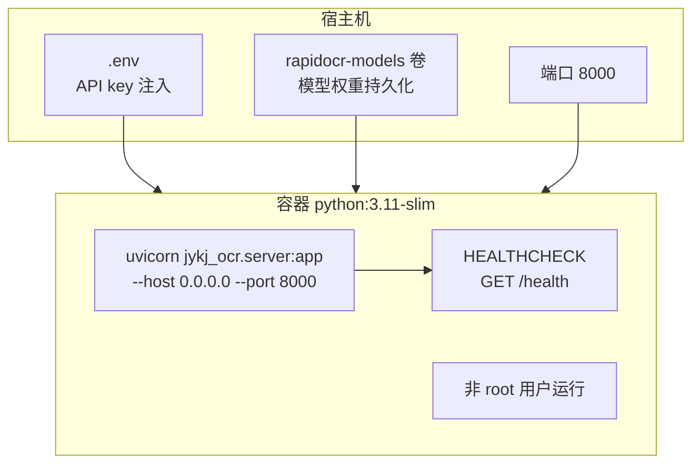

- 基础镜像 `python:3.11-slim`,非 root 用户运行
- `HEALTHCHECK` 探测 `/health`
- 配置/端口:`JYKJ_OCR_CONFIG` / `JYKJ_OCR_PORT`
- compose 持久化 RapidOCR 模型权重到 `rapidocr-models` 卷,避免重复下载

---

## 5. 测试

```bash
.venv/Scripts/python -m pytest tests -q
```

- **CI 基线**:137 个用例,全部离线运行,无真实 API 调用,monkeypatch 模拟引擎返回
- 覆盖:models、config、strategy、engines(multimodal OpenAI 响应解析、rapidocr
  1.x/1.4.x/2.x 返回形态)、策略预设(local/vl/seq*/bestof*、deepcopy 不变性、
  `JYKJ_OCR_REMOTE_ENGINES` 扩展)、窜行检测与阅读顺序重排、inputs 魔数识别

端到端接口测试(需联网 + key,非 CI):

```bash
export OPENAI_API_KEY=...  OPENAI_BASE_URL=https://api.siliconflow.cn/v1
.venv/Scripts/python scripts/test_interfaces.py
```

---

# 第二篇 · 使用篇

使用 jykj_ocr 有两种方式:

- **Python SDK** — 直接在 Python 代码里调用,适合嵌入业务逻辑
- **RESTful API** — 通过 HTTP 请求调用,适合跨语言、跨服务集成

两种方式使用的**同一套引擎、同一套策略、同一套配置**,结果完全一致。

---

## 6. 快速开始

### 6.1 三行代码识别一张图

**Python SDK**:

```python
import jykj_ocr

# 离线识别,一行搞定
text = jykj_ocr.ocr_to_text("scan.png", engine="rapidocr")
print(text)
```

**RESTful API**:

```bash
python -m jykj_ocr serve --port 8000 &   # 启动服务

curl -s http://localhost:8000/ocr \
  -F "file=@scan.png" \
  -F "engine=rapidocr" \
  -F "format=json"
```

两种调用路径的**请求处理流程**完全相同:

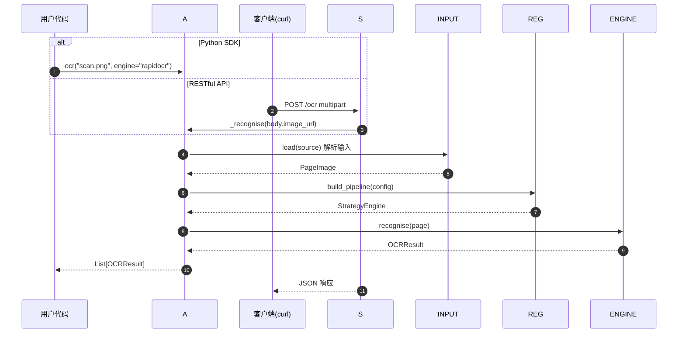

---

## 7. Python SDK

> 完整可运行示例见 `scripts/demo.py`(`python scripts/demo.py [图片路径]`),
> 四种场景一次跑通。

### 7.1 核心函数

```python
ocr(source: str, *,
   engine: str | None = None,
   config: Config | None = None,
   config_path: str | None = None,
   max_pages: int | None = None,
   dpi: int = 200,
   retries: int = 1,
   strategy_name: str | None = None) -> List[OCRResult]

ocr_to_text(source: str, ...) -> str
```

### 7.2 输入格式(`source` 参数)

`source` 支持三种形式:

| 形式 | 示例 | 说明 |
|------|------|------|
| 本地文件路径 | `"scan.png"`, `"/data/report.pdf"` | 图片(PNG/JPG/GIF/BMP/WebP/TIFF)或 PDF |
| HTTP URL | `"https://example.com/scan.png"` | 自动下载后识别,支持无扩展名 URL(魔数识别) |
| data URI | `"data:image/png;base64,xxxx"` | 内联图片字节,无需写盘 |

**不接受裸 bytes**。如需识别内存图片:

```python
import base64
payload = base64.b64encode(img_bytes).decode()
data_uri = f"data:image/png;base64,{payload}"
results = jykj_ocr.ocr(data_uri, engine="rapidocr")
```

### 7.3 输出结构(`OCRResult`)

`ocr()` 返回 `List[OCRResult]`,每个元素为一页:

```python
results = jykj_ocr.ocr("report.pdf", max_pages=2)
for page in results:
    print(f"--- 第 {results.index(page)+1} 页 ---")
    print(f"引擎: {page.engine}")        # "rapidocr"
    print(f"模型: {page.model}")         # "rapidocr-onnxruntime"
    print(f"耗时: {page.elapsed_ms}ms")
    print(f"尺寸: {page.width}×{page.height}")
    print(f"文本: {page.text}")
    for region in page.regions:
        print(f"  [{region.confidence:.2f}] {region.text}")
        print(f"    位置: {region.bbox.x1},{region.bbox.y1} - {region.bbox.x2},{region.bbox.y2}")
```

`OCRResult` 字段:

| 字段 | 类型 | 说明 |
|------|------|------|
| `text` | `str` | 该页识别的全文 |
| `regions` | `List[TextRegion]` | 各文本块(含 bbox/confidence) |
| `engine` | `str` | 实际使用的引擎 |
| `model` | `str` | 模型名(本地引擎为 onnx 版本号,远程为模型名) |
| `elapsed_ms` | `int` | 识别耗时(毫秒) |
| `width` / `height` | `int` | 页面像素尺寸 |
| `ok` | `bool` | 是否有可用文本 |

### 7.4 输出结构示意

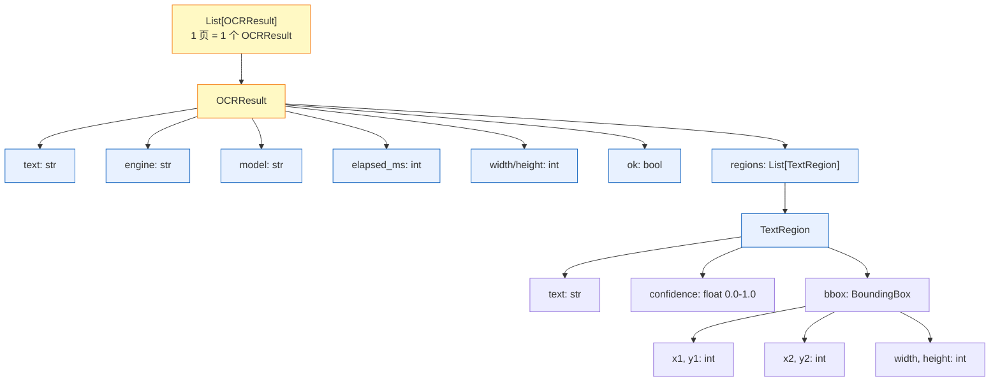

### 7.5 完整案例

#### 案例 1:离线识别单张图片

```python
import jykj_ocr

results = jykj_ocr.ocr("scan.png", engine="rapidocr")
for r in results:
    print(r.engine, r.model, len(r.regions), "regions")
    print(r.text)
```

#### 案例 2:识别 PDF 前 10 页,指定 DPI

```python
results = jykj_ocr.ocr("report.pdf", max_pages=10, dpi=300)
full_text = "\n\n".join(r.text for r in results)
print(f"共 {len(results)} 页,总计 {len(full_text)} 字")
```

#### 案例 3:远程识别(硅基流动)

```python
# 需提前设置 OPENAI_API_KEY
results = jykj_ocr.ocr("scan.png", engine="siliconflow")
for r in results:
    print(f"引擎={r.engine} 模型={r.model} 区域数={len(r.regions)}")
    print(r.text)
```

#### 案例 4:使用命名预设(窜行自动降级 + 阅读顺序重排)

```python
results = jykj_ocr.ocr("stamp.png", strategy_name="quality")
# quality == seq-any:rapidocr 窜行时自动降级到 VL,并重排阅读顺序
```

#### 案例 5:最佳策略(所有引擎各跑一次,选最优)

```python
results = jykj_ocr.ocr("scan.png", strategy_name="bestof-smart")
# bestof-smart:置信度 × 100 − 窜行惩罚 + 文本长度 + 语义流畅度
```

#### 案例 6:只取拼接好的文本

```python
text = jykj_ocr.ocr_to_text("scan.png", engine="rapidocr")
print(text)   # 纯文本,无 JSON 包裹
```

#### 案例 7:用 data URI 识别内存图片

```python
import base64
with open("scan.png", "rb") as f:
    payload = base64.b64encode(f.read()).decode()
data_uri = f"data:image/png;base64,{payload}"
results = jykj_ocr.ocr(data_uri, engine="rapidocr")
```

---

## 8. RESTful API

### 8.1 启动服务

```bash
python -m jykj_ocr serve --port 8000
# 或
JYKJ_OCR_PORT=8000 python -m uvicorn jykj_ocr.server:app --host 0.0.0.0
```

启动后访问 `http://localhost:8000/docs` 查看交互式 Swagger 文档。

### 8.2 端点一览

| 方法 | 路径 | 输入方式 | 输出结构 |
|------|------|----------|:---:|
| `POST` | `/ocr` | multipart 上传文件 | ✅ 统一(见 §8.4) |
| `POST` | `/ocr/{preset}` | multipart 上传文件 | ✅ 统一(见 §8.4) |
| `POST` | `/ocr/text` | JSON body | ✅ 统一(见 §8.4) |
| `POST` | `/ocr/{preset}/text` | JSON body | ✅ 统一(见 §8.4) |
| `GET` | `/config` | — | ❌ 单独结构 |
| `POST` | `/config` | JSON body(运行时覆盖) | ❌ 单独结构 |
| `DELETE` | `/config` | — | ❌ 单独结构 |
| `GET` | `/health` | — | ❌ `{status, engines}` |
| `GET` | `/engines` | — | ❌ `{engines, configured}` |

**四个 OCR 端点返回结构完全一致**(`{pages, text, engine, page_count}`)。只有 `format=text`/`markdown` 时退化为纯文本。`{preset}` 路径参数见 §9.1(命名策略预设)。

### 8.3 输入格式

#### 8.3.1 multipart 上传(`POST /ocr`、`POST /ocr/{preset}`)

**表单字段**:

| 字段 | 类型 | 必填 | 说明 |
|------|------|:----:|------|
| `file` | File | ✅ | 图片或 PDF 文件 |
| `engine` | string | — | 强制指定引擎(如 `rapidocr`/`siliconflow`) |
| `model` | string | — | 覆盖模型名(仅远程引擎生效) |
| `prompt` | string | — | 覆盖 prompt(仅远程引擎生效) |
| `strategy` | JSON string | — | 临时策略对象(如 `{"retry_mode":"any","max_retries":2}`) |
| `strategy_name` | string | — | 一次性命名预设:`local`/`vl`/`seq*`/`bestof*` |
| `max_pages` | int | — | PDF 页数上限 |
| `dpi` | int | 200 | PDF 渲染 DPI |
| `format` | string | json | 输出格式:`json`/`text`/`markdown` |

**数据流**:

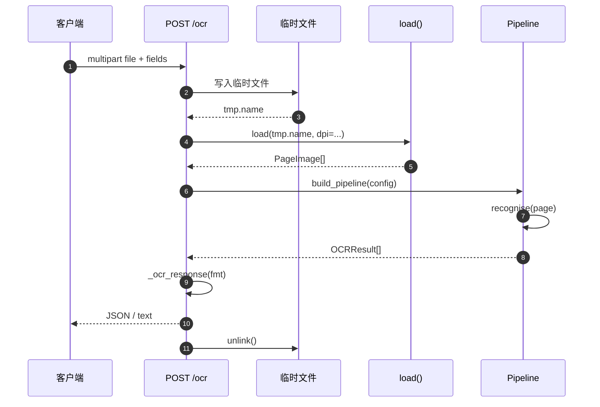

**示例**:

```bash
# 上传本地图片,指定引擎和输出格式
curl -s http://localhost:8000/ocr \
  -F "file=@scan.png" \
  -F "engine=siliconflow" \
  -F "format=json"

# 上传 PDF,只处理前 5 页,300 DPI
curl -s http://localhost:8000/ocr \
  -F "file=@report.pdf" \
  -F "max_pages=5" \
  -F "dpi=300"

# 使用命名预设路由:所有引擎择优
curl -s http://localhost:8000/ocr/bestof \
  -F "file=@scan.png" \
  -F "format=json"

# 路由 + 覆盖模型
curl -s http://localhost:8000/ocr/siliconflow \
  -F "file=@scan.png" \
  -F "model=Qwen/Qwen2.5-VL-72B" \
  -F "format=text"
```

#### 8.3.2 JSON body(`POST /ocr/text`、`POST /ocr/{preset}/text`)

**图片来源(三选一,只能传一个)**:

| 字段 | 类型 | 说明 |
|------|------|------|
| `image_url` | string | 本地路径或 `http(s)://` URL |
| `image_b64` | string | 纯 base64 字符串(自动加 `data:` 前缀) |
| `image_data` | string | 完整 data URI,如 `data:image/png;base64,xxxx` |

**通用字段**:

| 字段 | 类型 | 默认 | 说明 |
|------|------|:----:|------|
| `engine` | string | — | 强制引擎 |
| `model` | string | — | 覆盖模型(仅远程引擎) |
| `prompt` | string | — | 覆盖 prompt(仅远程引擎) |
| `strategy` | object | — | 临时策略 JSON 对象 |
| `strategy_name` | string | — | 一次性命名预设 |
| `max_pages` | int | — | PDF 页数上限 |
| `dpi` | int | 200 | PDF 渲染 DPI |
| `format` | string | `json` | 输出格式 |

**三选一校验流程**:

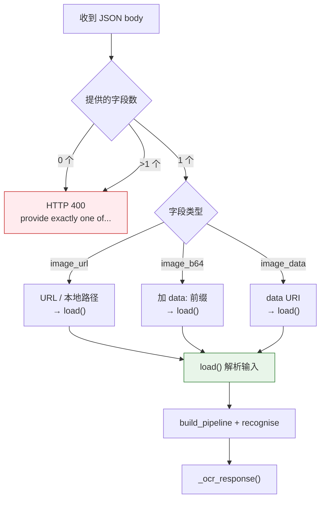

**示例**:

```bash
# 按 URL 识别(最常用)
curl -s http://localhost:8000/ocr/text \
  -H "Content-Type: application/json" \
  -d '{"image_url":"https://example.com/scan.png","engine":"multimodal","format":"json"}'

# URL 无扩展名也能识别(按文件头魔数自动判型)
curl -s http://localhost:8000/ocr/text \
  -H "Content-Type: application/json" \
  -d '{"image_url":"https://example.com/img/u=1234&fm=3074","strategy_name":"vl"}'

# 传 base64 字符串
curl -s http://localhost:8000/ocr/text \
  -H "Content-Type: application/json" \
  -d '{"image_b64":"iVBORw0KGgoAAAANSUhEUgAA...","engine":"rapidocr"}'

# 传完整 data URI
curl -s http://localhost:8000/ocr/text \
  -H "Content-Type: application/json" \
  -d '{"image_data":"data:image/png;base64,iVBORw0KGgoAAA...","engine":"rapidocr"}'

# 路由即策略:用 bestof 预设,base64 输入
curl -s http://localhost:8000/ocr/bestof/text \
  -H "Content-Type: application/json" \
  -d '{"image_b64":"iVBORw0KGgoAAA...","format":"json"}'

# 本地文件路径(容器环境挂载共享目录时可用)
curl -s http://localhost:8000/ocr/text \
  -H "Content-Type: application/json" \
  -d '{"image_url":"/data/scan.png","engine":"rapidocr"}'
```

> **注意**:三个图片来源字段只能传一个,传零个或传多个都会返回 HTTP 400
> `{"detail":"provide exactly one of image_url, image_b64, or image_data"}`。

### 8.4 输出格式

#### 8.4.1 JSON 格式(`format=json`,默认)

所有四个 OCR 端点返回**完全相同**的结构:

```json
{
  "pages": [
    {
      "text": "永和九年,岁在癸丑,暮春之初...",
      "engine": "rapidocr",
      "model": "rapidocr-onnxruntime",
      "elapsed_ms": 10286,
      "width": 750,
      "height": 1390,
      "region_count": 166,
      "regions": [
        {
          "text": "永和九年岁在癸丑",
          "confidence": 0.97,
          "bbox": {
            "x1": 672,
            "y1": 12,
            "x2": 737,
            "y2": 1370,
            "width": 65,
            "height": 1358
          },
          "engine": "rapidocr"
        }
      ]
    }
  ],
  "text": "永和九年,岁在癸丑...\n\n(多页时用双换行拼接)",
  "engine": "rapidocr",
  "page_count": 1
}
```

**字段说明**:

| 字段 | 类型 | 说明 |
|------|------|------|
| `pages` | array | 每页一个对象;单图也是 1 个元素 |
| `pages[].text` | string | 该页识别全文 |
| `pages[].engine` | string | 该页最终使用的引擎名 |
| `pages[].model` | string | 模型名(本地引擎为 onnx 版本号,远程为模型名) |
| `pages[].elapsed_ms` | int | 该页识别耗时(毫秒) |
| `pages[].width` / `height` | int | 页面像素尺寸 |
| `pages[].region_count` | int | 文本区域数量 |
| `pages[].regions` | array | 每个文本区域的详细信息 |
| `pages[].regions[].text` | string | 该区域的文字 |
| `pages[].regions[].confidence` | float | 置信度 0.0–1.0 |
| `pages[].regions[].bbox` | object | 边界框(含 x1/y1/x2/y2/width/height) |
| `pages[].regions[].engine` | string | 识别该区域的引擎 |
| `text` | string | 所有页拼接后的完整文本 |
| `engine` | string | 最终使用的引擎(单页时等于 `pages[0].engine`) |
| `page_count` | int | 页数 |

**输出结构示意**:


**多页 PDF 示例**:

```json
{
  "pages": [
    {
      "text": "第一章 引言",
      "engine": "rapidocr",
      "model": "rapidocr-onnxruntime",
      "elapsed_ms": 8500,
      "width": 595,
      "height": 842,
      "region_count": 42,
      "regions": [...]
    },
    {
      "text": "第二章 方法",
      "engine": "rapidocr",
      "model": "rapidocr-onnxruntime",
      "elapsed_ms": 9200,
      "width": 595,
      "height": 842,
      "region_count": 58,
      "regions": [...]
    }
  ],
  "text": "第一章 引言\n\n第二章 方法",
  "engine": "rapidocr",
  "page_count": 2
}
```

#### 8.4.2 text / markdown 格式(`format=text` 或 `format=markdown`)

直接返回拼接后的纯文本(每个页面的 markdown 卡片用双换行拼接),
无 JSON 包裹,`Content-Type: text/plain`:

```text
# 识别结果 - 第 1 页

- **engine**: rapidocr
- **model**: rapidocr-onnxruntime
- **elapsed_ms**: 10286
- **size**: 750 × 1390
- **regions**: 166

## 文本

永和九年,岁在癸丑,暮春之初,会于会稽山阴之兰亭...
```

两种格式内容完全相同,`text` 和 `markdown` 可互换使用。

### 8.5 完整案例

#### 案例 1:上传文件,JSON 输出

```bash
curl -s -X POST http://localhost:8000/ocr \
  -F "file=@tests/兰亭序.jpeg" \
  -F "engine=rapidocr" \
  -F "format=json"
```

```json
{
  "pages": [{
    "text": "永和九年岁在癸丑...",
    "engine": "rapidocr",
    "model": "rapidocr-onnxruntime",
    "elapsed_ms": 10286,
    "width": 750,
    "height": 1390,
    "region_count": 166,
    "regions": [
      {"text": "永和九年岁在癸丑", "confidence": 0.97, "bbox": {...}, "engine": "rapidocr"}
    ]
  }],
  "text": "永和九年岁在癸丑...",
  "engine": "rapidocr",
  "page_count": 1
}
```

#### 案例 2:URL 识别,markdown 输出

```bash
curl -s -X POST http://localhost:8000/ocr/text \
  -H "Content-Type: application/json" \
  -d '{
    "image_url": "https://example.com/scan.png",
    "engine": "siliconflow",
    "format": "markdown"
  }'
```

```text
# 识别结果 - 第 1 页

- **engine**: siliconflow
- **model**: PaddlePaddle/PaddleOCR-VL-1.5
- **elapsed_ms**: 8500
- **size**: 800 × 1200
- **regions**: 24

## 文本

永和九年,岁在癸丑,暮春之初...
```

#### 案例 3:base64 识别,JSON 输出

```bash
curl -s -X POST http://localhost:8000/ocr/text \
  -H "Content-Type: application/json" \
  -d '{
    "image_b64": "iVBORw0KGgoAAAANSUhEUgAA...",
    "engine": "rapidocr",
    "format": "json"
  }'
```

#### 案例 4:策略预设路由 + 临时覆盖

```bash
curl -s -X POST http://localhost:8000/ocr/bestof \
  -F "file=@scan.png" \
  -F "model=Qwen/Qwen2.5-VL-72B" \
  -F "format=json"
```

路由参数 `bestof` 指定"所有引擎各跑一次,按 smart 评分选最佳";
`model` 覆盖远程引擎的模型为 Qwen2.5-VL-72B。

#### 案例 5:运行时调整策略 + 按 URL 识别

```bash
# 先调整策略:降低置信度阈值,增大重试次数
curl -s -X POST http://localhost:8000/config \
  -H "Content-Type: application/json" \
  -d '{"strategy": {"retry_mode": "low_confidence", "min_confidence": 0.6, "max_retries": 2}}'

# 再识别,自动应用新策略
curl -s http://localhost:8000/ocr/text \
  -H "Content-Type: application/json" \
  -d '{"image_url": "https://example.com/blurry.png", "engine": "rapidocr"}'
```

### 8.6 运行时配置 `GET/POST/DELETE /config`

不重启改模型或引擎顺序:

```bash
# 查看当前配置(不泄露 key)
curl -s http://localhost:8000/config
```

```json
{
  "engines": [
    {"name": "rapidocr", "enabled": true, "model": "", "base_url": ""},
    {"name": "siliconflow", "enabled": true, "model": "PaddlePaddle/PaddleOCR-VL-1.5", "base_url": "https://api.siliconflow.cn/v1"},
    {"name": "multimodal", "enabled": false}
  ],
  "strategy": {"max_retries": 1, "retry_mode": "no_text", "min_confidence": 0.7},
  "has_api_key": true,
  "overridden": false
}
```

```bash
# 切换模型(不回显 key)
curl -s -X POST http://localhost:8000/config \
  -H "Content-Type: application/json" \
  -d '{"engines":[{"name":"siliconflow","model":"Qwen/Qwen2.5-VL-72B"}]}'

# 调整策略
curl -s -X POST http://localhost:8000/config \
  -H "Content-Type: application/json" \
  -d '{"strategy":{"max_retries":2,"retry_mode":"low_confidence","min_confidence":0.8}}'

# 还原到 config.yaml 默认值
curl -s -X DELETE http://localhost:8000/config
```

> `GET /config` 永远只返回 `has_api_key: true/false` 布尔值,绝不返回 key 明文。

### 8.7 辅助端点

```bash
# 健康检查
curl -s http://localhost:8000/health
# {"status":"ok","engines":["rapidocr","siliconflow","multimodal"]}

# 引擎列表
curl -s http://localhost:8000/engines
# {"engines":{"rapidocr":"本地...","siliconflow":"硅基流动...","multimodal":"通用OpenAI兼容..."},"configured":["rapidocr","siliconflow","multimodal"]}
```

### 8.8 异常映射

所有异常统一返回 `{"detail": "错误描述"}` 格式。

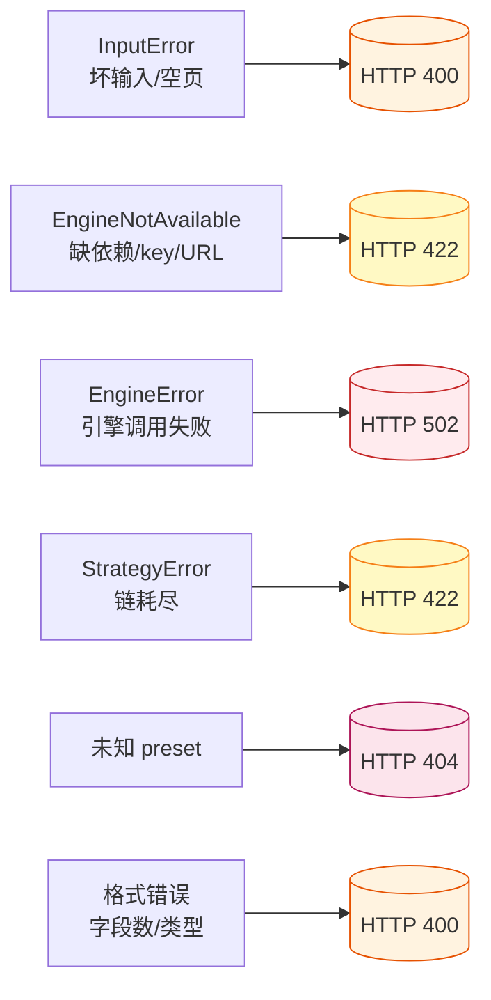

| 异常 | HTTP 状态码 | 典型场景 | 响应示例 |
|------|:----:|------|------|
| `InputError` | 400 | 文件不存在、图片损坏、URL 无法下载、base64 解码失败 | `{"detail":"input not found: /tmp/x.png"}` |
| `EngineNotAvailable` | 422 | 缺少依赖库、API key 为空、base_url 未配置 | `{"detail":"siliconflow requires OPENAI_API_KEY"}` |
| `EngineError` | 502 | 引擎调用超时、HTTP 402 余额不足、网络错误 | `{"detail":"HTTP 402","engine":"siliconflow"}` |
| `StrategyError` | 422 | 策略链中所有引擎均失败且无可用结果 | `{"detail":"all engines exhausted"}` |
| 未知 preset | 404 | `/ocr/xxx` 路由既非引擎也非策略预设 | `{"detail":"unknown preset 'xxx'..."}` |
| 格式错误 | 400 | 图片三选一只传一个、format 非法、strategy JSON 非对象 | `{"detail":"provide exactly one of image_url, image_b64, or image_data"}` |

---

## 9. 策略预设

### 9.1 两种策略模型总览

jykj_ocr 提供**两类**策略,解决不同场景:

| 策略家族 | 引擎调用方式 | 何时选它 |
|----------|--------------|----------|
| **顺序预设**(`local`/`vl`/`seq*`/`fallback`/`quality`) | 按 `config.engines` 顺序一个接一个尝试,**第一个命中即返回**;不通过再试下一个 | 日常生产:引擎 A 能用就用 A,失败才降级到 B——快,省钱 |
| **最佳预设**(`bestof`/`bestof-*`) | **所有引擎各跑一次**,按评分函数挑得分最高的那一个 | 对质量要求极高:不在乎多花几倍时间,只要结果最好 |

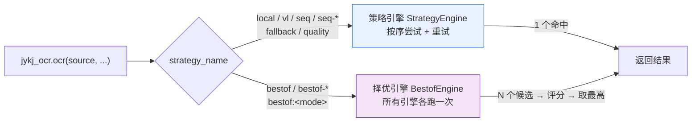

### 9.2 顺序预设(`seq*`,走 `StrategyEngine`)

**工作机制**:引擎按 `config.engines` 数组顺序排列,从第一个开始 `recognise()`;
结果通过 `retry_check` 谓词(见 §9.4)判定是否合格——合格即返回,不合格才切换下一个。
每个引擎最多重试 `max_retries` 次。


**各预设细节**:

| 预设 | 引擎范围 | retry_mode | 阅读顺序重排 | 适用场景 |
|------|----------|:----:|:---:|----------|
| `local` | 仅本地(rapidocr 家族) | `no_text` | — | 离线、隐私敏感、批量低成本 |
| `vl` | 仅远程 VL 大模型 | `no_text` | — | 版面复杂、手写、表格 |
| `seq` | 全部启用引擎 | `no_text` | — | 通用生产链路(**默认**) |
| `seq-any` | 同 seq + 窜行降级 | `any`(低置信度或窜行任一) | ✅ | 盖章/倾斜导致 rapidocr 窜行 |
| `seq-low_conf` | 全部启用引擎 | `low_confidence` | — | 低置信度自动降级 |
| `seq-line_overlap` | 全部启用引擎 | `line_overlap` | — | 窜行时自动降级 |
| `fallback` | 同 seq | — | — | legacy 别名 |
| `quality` | 同 seq-any | — | — | legacy 别名 |

**示例**:

```python
# 通用生产:rapidocr 优先,失败才降级
results = jykj_ocr.ocr("scan.png")              # 默认 seq

# 仅本地引擎(离线场景)
results = jykj_ocr.ocr("scan.png", strategy_name="local")

# 窜行自动降级 + 阅读顺序重排
results = jykj_ocr.ocr("stamp.png", strategy_name="quality")

# HTTP 端点
curl -s http://localhost:8000/ocr/quality \
  -F "file=@scan.png" -F "format=json"
curl -s http://localhost:8000/ocr/vl \
  -F "file=@scan.png" -F "format=json"
```

**阅读顺序重排**(仅 `seq-any`/`quality` 开启):当检测到窜行时,`rebuild_text_from_regions()`
按 bbox 的 `y1` 升序、同行内按 `x1` 升序重排所有 `TextRegion`,让输出"读起来像人话"。

### 9.3 最佳预设(`bestof*`,走 `BestofEngine`)

**工作机制**:所有已启用引擎**各跑一次**,拿到 N 个候选结果后,按评分函数打分,
**返回得分最高的那一个**。

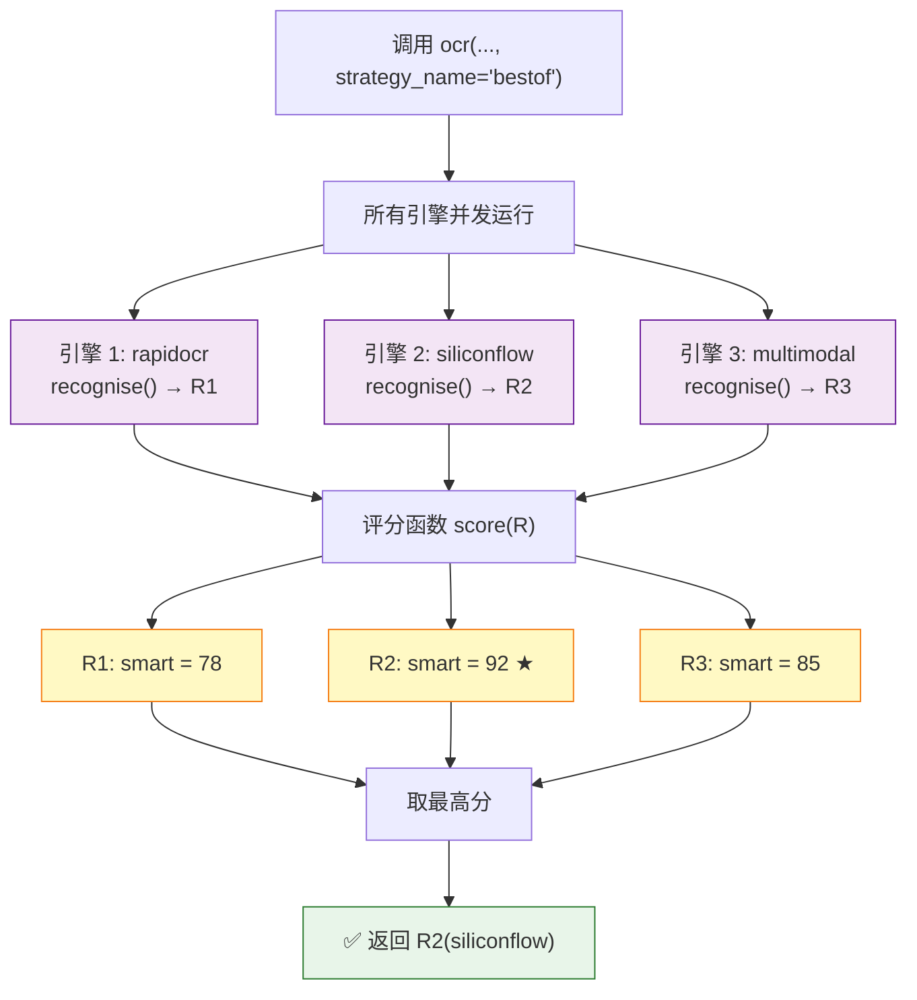

**各评分模式详解**:

| 预设 | 评分函数 | 得分公式 | 适用场景 |
|------|----------|----------|----------|
| `bestof` / `bestof-smart` | **综合最优**(**推荐**) | `置信度 × 100 − 窜行惩罚 20 + 文本长度上限 1 + 语义流畅度` | 通用质量最优,自动规避碎片化输出 |
| `bestof-fastest` | 最快 | `−elapsed_ms`(数值越小越好) | 追求速度 |
| `bestof-confidence` | 置信度最高 | `mean(confidence)` | 追求每字准确 |
| `bestof-longest` | 文本最长 | `len(text)` | 追求完整性,不漏字 |
| `bestof-fluency` | 语义流畅度 | `短语密度 + CJK 标点 − 单字碎片惩罚` | 追求"读起来像人话" |
| `bestof:<mode>` | 同上任意 mode | 等价于 `bestof-mode` | 冒号语法别名 |

**智能评分 `smart` 打分拆解**:

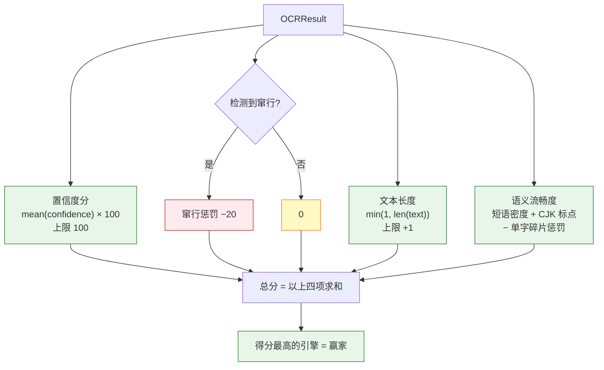

**语义流畅度(`_fluency_score`)打分信号**:

| 信号 | 分值范围 | 判定逻辑 |
|------|:----:|----------|
| 短语密度 | `0 ~ +15` | 每个区域平均字符数;句子越长越连贯 |
| CJK 标点比例 | `0 ~ +5` | `,。！？、；:()`等占比——有标点即像自然语言 |
| 单字碎片惩罚 | `0 ~ −25` | `len(text)==1` 的区域数 × 0.3——单字越多扣越多 |

> **对兰亭序实测**:rapidocr 输出 166 个单字/短词(fluency ≈ **−23**),
> siliconflow 输出完整古文句子(fluency ≈ **+15**)——`bestof-smart`/`bestof-fluency`
> 都能正确选中硅基流动。

**示例**:

```python
# 综合最优(推荐)
results = jykj_ocr.ocr("scan.png", strategy_name="bestof")

# 所有引擎各跑一次,按最快耗时选
results = jykj_ocr.ocr("scan.png", strategy_name="bestof-fastest")

# 冒号语法:等价于 bestof-fluency
results = jykj_ocr.ocr("scan.png", strategy_name="bestof:fluency")

# HTTP
curl -s http://localhost:8000/ocr/bestof \
  -F "file=@scan.png" -F "format=json"
curl -s http://localhost:8000/ocr/bestof-confidence/text \
  -H "Content-Type: application/json" \
  -d '{"image_url":"https://example.com/img.png","format":"text"}'
```

**`bestof` vs `seq*` 取舍**:

- `bestof` 比 `seq*` 慢(所有引擎都跑),但能拿到所有候选里最好的结果
- `seq*` 快(首个命中即返回),适合"引擎 A 大多数时候够用,偶尔才降级"的场景

### 9.4 底层重试模式(retry_mode)

所有 `seq*` 预设最终都落到 `retry_mode`。策略引擎按 `config.engines` 顺序尝试,
每个引擎最多重试 `max_retries` 次,由下列谓词决定是否换引擎:

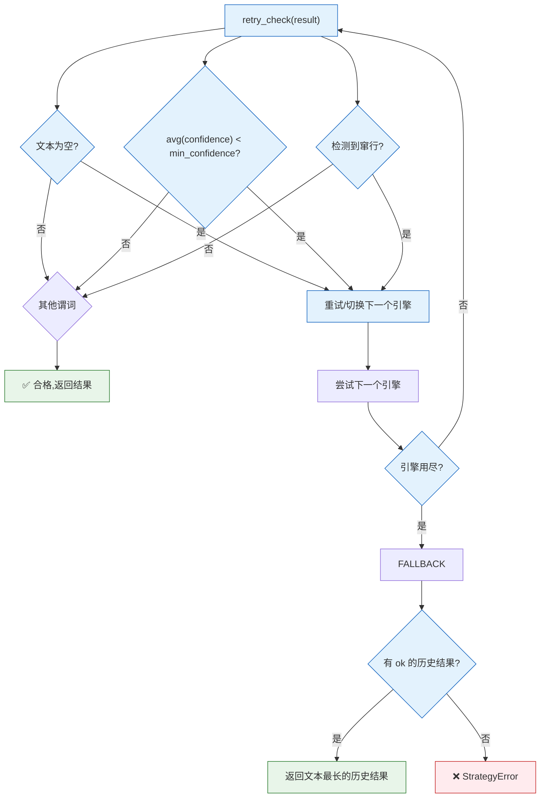

| `retry_mode` | 行为 |
|--------------|------|
| `no_text` | 结果无文本 → 重试/切换(**默认**) |
| `low_confidence` | 平均置信度 < `min_confidence` → 重试/切换 |
| `line_overlap` | 无文本**或**检测到窜行 → 重试/切换 |
| `any` | 低置信度**或**窜行任一命中 → 重试/切换(`combine_predicates` 组合) |
| `none` / `first_success` | 第一个成功结果即返回,不重试 |

**链耗尽兜底**:若所有引擎都失败或无文本,但某个引擎曾产出 `ok` 结果——返回其中**文本最长**的那个;若完全没有任何 `ok` 结果,抛 `StrategyError`(HTTP 422)。手动调参示例:

```bash
curl -s -X POST http://localhost:8000/config \
  -H "Content-Type: application/json" \
  -d '{"strategy":{"retry_mode":"any","min_confidence":0.75,"max_retries":2}}'
```

### 9.5 更多 OCR 引擎接入

本地/远程划分走 `remote_engines()`(内置 siliconflow、multimodal)。新注册引擎
**无需改代码**即被预设识别。要把新厂商归入远程侧:

```bash
export JYKJ_OCR_REMOTE_ENGINES="paddlecloud,acme-vl"   # 逗号分隔,小写
```

---

## 10. 常见问题

**Q: multimodal 报 "no base URL"?**
A: 没设 `OPENAI_BASE_URL` 且 config.yaml 中 multimodal 的 `base_url` 留空。multimodal
   不会自动回退到硅基流动(避免把别家 key 发到硅基流动),必须显式给 URL。

**Q: siliconflow 报 HTTP 402 / 余额不足?**
A: 账号余额不足,需充值。key 格式正确,请求已到达模型端点。

**Q: rapidocr 返回乱码或全是数字?**
A: `rapidocr-onnxruntime` 1.4.x 返回 `(results, elapsed)` 2-tuple,与 1.x 不同。
   已在 `_run()` 用 `_looks_like_results_list()` 适配;若升级到新大版本需检查返回形态。

**Q: 怎么换平台?**
A: 改 `OPENAI_BASE_URL` 与 `OPENAI_API_KEY` 两个环境变量,代码与配置不动。
   multimodal 引擎会自动走新端点。

**Q: 内存里的图片怎么识别?**
A: 先 `base64.b64encode(img_bytes).decode()` 后拼接为
   `data:image/png;base64,<payload>` 传入,或先写入临时文件再传路径。

**Q: API key 会被泄露吗?**
A: 不会。`.env` 已 gitignore;`GET /config` 只返回 `has_api_key` 布尔;
   运行时覆盖 `POST /config` 接受 `api_key` 字段但同样不回显明文。