# jykj_ocr 用户手册

本手册面向实际使用 jykj_ocr 的开发者与运维人员,分为两篇:

- **第一篇:部署篇** — 安装、配置、Docker、测试
- **第二篇:使用篇** — Python SDK 与 RESTful API 调用,含完整输入/输出格式与案例

---

# 第一篇 · 部署篇

## 1. 系统要求与架构概览

### 1.1 前置要求

- Python 3.10+
- 本地 OCR 无需任何外部服务或 API key
- 远程多模态 OCR 需要一个 OpenAI 兼容端点 + 对应 API key

### 1.2 系统架构

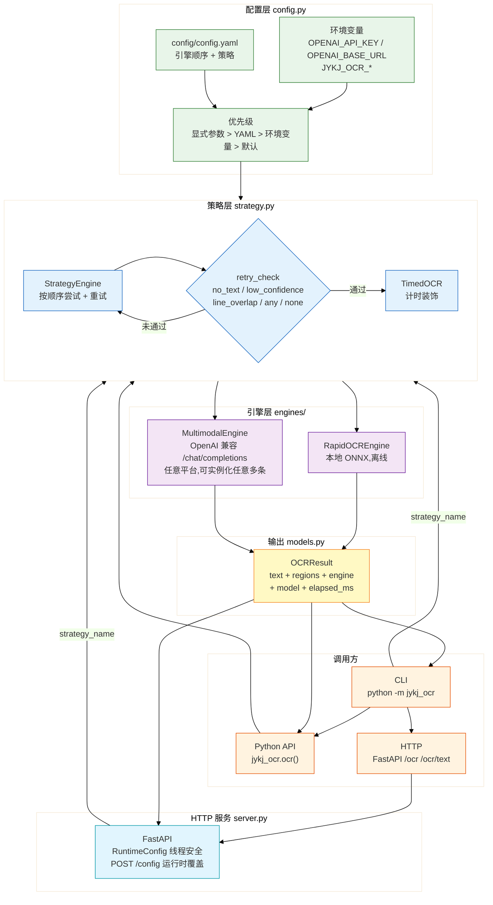

### 1.3 数据流(以一次 HTTP 请求为例)


---

## 2. 安装

```bash
git clone <repo> jykj_ocr && cd jykj_ocr
python -m venv .venv
.venv/Scripts/activate          # Windows
# source .venv/bin/activate      # Linux/macOS
pip install -r requirements.txt
pip install -e .                 # 可选,注册 jykj-ocr 命令行入口
```

`requirements.txt` 自包含:核心运行依赖 + 测试依赖(`pytest`、`httpx`、`ruff`)。
`rapidocr-onnxruntime` 已列入其中,首次运行会自动下载模型权重。

验证安装:

```bash
python -m jykj_ocr --list-engines
# rapidocr       本地 RapidOCR (ONNX),无需 API key,离线可用
# multimodal     OpenAI 兼容多模态端点(硅基流动 / 百炼 / 火山 / vLLM 等任意平台,
#                可配置多个实例)
```

---

## 3. 配置

### 3.1 环境变量(远程引擎)

`base_url` / `model` / `api_key` 三个字段走同一套规则:**yaml 条目里的字段** >
**带序号的环境变量**(`*_<N>`) > **不带序号的环境变量**(该类型所有条目共享)。
序号 `<N>` 是「同类型里的第 N 条」,按 yaml 书写顺序编号,数量不限,各类型独立计数
(rapidocr 不占 multimodal 的号)——所以配置里有几条 `multimodal` 就设几套带序号的
变量,**yaml 里可以完全不写 URL / 模型 / key**。

```bash
# 单平台:不带序号的就够,适配任意 OpenAI 兼容端点
export OPENAI_API_KEY=sk-xxxxxxxx
export OPENAI_BASE_URL=https://api.siliconflow.cn/v1

# 多平台/多账号:按 yaml 里的顺序给每条各设一套(数量不限)
export OPENAI_BASE_URL_1=https://api.siliconflow.cn/v1
export OPENAI_BASE_URL_2=https://api.moark.com/v1
export JYKJ_OCR_MULTIMODAL_1_API_KEY=***
export JYKJ_OCR_MULTIMODAL_2_API_KEY=***
export JYKJ_OCR_MULTIMODAL_1_MODEL=PaddlePaddle/PaddleOCR-VL-1.5
export JYKJ_OCR_MULTIMODAL_2_MODEL=PaddleOCR-VL-1.5
```

`.env` 文件是可选的便利手段(启动时读一次,`_load_dotenv` 找不到就跳过),本仓库
已不使用——Docker 侧用 `-e` 或 compose 的 `environment:` 注入。

| 变量 | 必需 | 作用 |
|------|:----:|------|
| `OPENAI_BASE_URL_<N>` | 多实例必需 | 第 N 条 `multimodal` 的端点 URL |
| `JYKJ_OCR_MULTIMODAL_<N>_API_KEY` | 多实例必需 | 第 N 条的 key。简写 `MULTIMODAL_<N>_API_KEY` 同样生效 |
| `JYKJ_OCR_MULTIMODAL_<N>_MODEL` | 可选 | 第 N 条的模型 ID |
| `OPENAI_API_KEY` | 远程引擎必需 | 通用 key,适配任意 OpenAI 兼容平台。所有条目共享——**只有单平台时够用** |
| `OPENAI_BASE_URL` | 远程引擎必需 | 通用端点 URL。所有条目共享,所以多平台必须改用 `OPENAI_BASE_URL_<N>`;解析不出来就报 `EngineNotAvailable`,不会静默回退到某个平台 |
| `JYKJ_OCR_MULTIMODAL_API_KEY` | 可选 | 所有 `multimodal` 条目共享的 key(按类型命名,不带序号) |
| `JYKJ_OCR_MULTIMODAL_MODEL` | 可选 | 所有 `multimodal` 条目共享的 model 回退值 |
| `JYKJ_OCR_CONFIG` | 可选 | 配置文件路径(默认 `config/config.yaml`) |
| `JYKJ_OCR_PORT` | 可选 | HTTP 服务端口(默认 8000) |
| `JYKJ_OCR_REMOTE_ENGINES` | 可选 | 逗号分隔,把新引擎追加进远程名单(`vl` 侧),见 §9.2 |
| `JYKJ_OCR_MIN_ENGINES` | 可选 | `seq*` / `cascade*` 所需最少已启用引擎数(1..99,默认 2),见 §9.1 |

> **多实例:序号是「同类型里的第 N 条」。** 各类型独立编号,rapidocr 不占
> `multimodal` 的号。`base_url` / `model` / `api_key` 三个字段都用同一套规则,
> 所以整个条目都可以用环境变量描述,yaml 里只留 `name: multimodal`。
>
> 想让某条的变量不随条目增删漂移,在 yaml 里显式钉住:
>
> ```yaml
> - name: multimodal
>   instance: 1        # 固定读 *_1_*;未钉住的条目自动跳过这个号
> ```
>
> yaml 里写了 `base_url` / `model` / `api_key` 就用 yaml,留空才读环境变量,
> 两种写法可以混用。写了真实 key 的 yaml 必须先加进 `.gitignore`,否则就是
> 提交密钥;走序号变量则可以完全不用把密钥写进任何文件。

切换平台示例(改两个变量即可,代码与配置文件不动):

| 平台 | `OPENAI_BASE_URL` |
|------|-------------------|
| 硅基流动 | `https://api.siliconflow.cn/v1` |
| 阿里云百炼 | `https://dashscope.aliyuncs.com/compatible-mode/v1` |
| 模力方舟 | `https://api.moark.com/v1`(注意用**裸模型 ID**,如 `PaddleOCR-VL-1.5`,不带 `PaddlePaddle/` 前缀) |
| 智谱 | `https://open.bigmodel.cn/api/paas/v4` |
| 本地 vLLM | `http://localhost:8000/v1` |

### 3.2 配置文件

定义引擎顺序、模型、策略:

```yaml
strategy:
  # ⚠️ strategy.name 是**文档字段,不生效** —— build_pipeline 从不读它切换预设,
  #    预设只能在接口上一次性应用(CLI --strategy-name / HTTP strategy_name /
  #    /ocr/{preset} 路由)。真正生效的只有下面四个键。
  max_retries: 1
  retry_mode: no_text        # no_text | low_confidence | line_overlap | any | none
  min_confidence: 0.7
  # bestof_mode: smart       # 单独写这个 → 组装 BestofEngine 而非 StrategyEngine

engines:
  - name: rapidocr           # 本地,离线
    lang: ch
    enabled: true

  - name: multimodal         # 硅基流动平台
    model: PaddlePaddle/PaddleOCR-VL-1.5
    base_url: https://api.siliconflow.cn/v1
    temperature: 0.0
    timeout: 180
    prompt: |
      请识别图片中的全部文字内容,按原文版面顺序输出。
      只输出文字,不要翻译、不要解释。

  - name: multimodal         # 第二个实例:留空 base_url 走 OPENAI_BASE_URL
    enabled: false
    model: qwen-vl-max        # 该平台只认裸模型 ID,不带厂商前缀
```

「只用本地 / 只用远程」靠的是条目里的 `enabled: false`,不是 `strategy.name`——
实测 `name: local` 仍会加载远程引擎,`name: bestof` 仍组装 `StrategyEngine`
(`tests/test_strategy_presets.py::test_build_pipeline_does_not_reapply_preset`
锁死了这一行为)。

仓库自带 4 份示例配置,用 `-c` 或 `JYKJ_OCR_CONFIG` 选用:

| 文件 | 内容 |
|------|------|
| `config/config.local.yaml` | 示例 1:只本地 rapidocr,零凭据 |
| `config/config.vl.yaml` | 示例 2:只远程 VL(硅基流动 + 模力方舟) |
| `config/config.seq.yaml` | 示例 3:本地 + 1 个远程兜底 |
| `config/config.bestof.yaml` | 示例 4:本地 + 2 个远程,bestof 评分选最佳 |

### 3.3 配置优先级

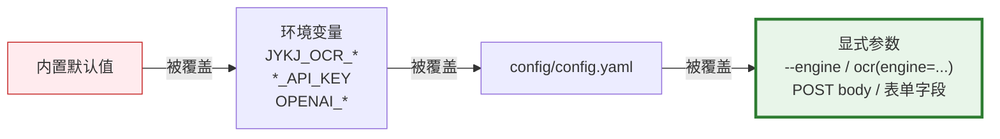

**口诀**:离用户最近的覆盖最远的。显式参数 > YAML 文件 > 环境变量 > 代码默认值。

这个方向和直觉相反,但确实是代码实现:三个 `resolved_*` 都是「yaml 有值就用 yaml,
留空才回退环境变量」——每一级都先读自己的字段,为空才去查环境变量。

| 字段 | yaml | 环境变量 | 默认值 |
|------|------|----------|--------|
| `base_url` | `base_url:` | `OPENAI_BASE_URL_<N>` → `OPENAI_BASE_URL` → `JYKJ_OCR_<NAME>_BASE_URL` | **无**——解析不出来即 `EngineNotAvailable` |
| `model` | `model:` | `JYKJ_OCR_<NAME>_<N>_MODEL` → `JYKJ_OCR_<NAME>_MODEL` | `PaddleOCR-VL-1.5`(裸 ID) |
| `api_key` | `api_key:` | `JYKJ_OCR_<NAME>_<N>_API_KEY` → `<NAME>_<N>_API_KEY` → `JYKJ_OCR_<NAME>_API_KEY` → `<NAME>_API_KEY` → `OPENAI_API_KEY` | 空 |

**实务后果**:如果 `config.yaml` 里写了 `base_url: https://a.com/v1`,而环境变量
`OPENAI_BASE_URL=https://b.com/v1`,实际走的是 **a.com**——yaml 赢。想让环境变量决定
平台,把 yaml 里的 `base_url` 留空即可(仓库默认 `config/config.yaml` 就是这么配的)。

环境变量只在进程启动时读入,改完**必须重启服务**才生效——已经在跑的进程不会热加载。

---

## 4. Docker 部署

```bash
# 构建并启动(含 healthcheck + 模型权重持久化)
docker compose up --build

# 单容器（凭据用 -e 直接注入,不需要在仓库里建 .env）
docker build -t jykj_ocr .
docker run --rm -p 8000:8000 \
    -e OPENAI_API_KEY=sk-... -e OPENAI_BASE_URL=https://api.siliconflow.cn/v1 jykj_ocr

# 容器内一次性任务
docker run --rm -e OPENAI_API_KEY=sk-... -v "$PWD:/data" jykj_ocr \
    python -m jykj_ocr /data/scan.png --engine multimodal
```

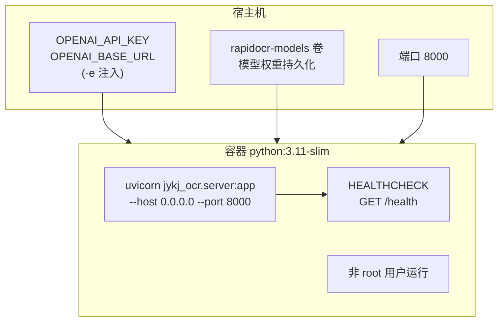

- 基础镜像 `python:3.11-slim`,非 root 用户运行
- `HEALTHCHECK` 探测 `/health`
- 配置/端口:`JYKJ_OCR_CONFIG` / `JYKJ_OCR_PORT`
- compose 持久化 RapidOCR 模型权重到 `rapidocr-models` 卷,避免重复下载

---

## 5. 测试

```bash
.venv/Scripts/python -m pytest tests -q
```

- **CI 基线**:342 个用例,全部离线运行,无真实 API 调用,monkeypatch 模拟引擎返回
- 覆盖:models、config(别名归一化、YAML、环境变量优先级、多 multimodal 实例去重)、
  strategy、engines(multimodal OpenAI 响应解析、rapidocr 1.x/1.4.x/2.x 返回形态)、
  策略预设(local/vl/seq*/cascade*/bestof*、deepcopy 不变性、`JYKJ_OCR_REMOTE_ENGINES` 扩展)、
  引擎个数下限(`tests/test_strategy_engine_count.py`:registry 层、HTTP 422、`/presets` 元数据、
  `JYKJ_OCR_MIN_ENGINES` 钳位)、
  窜行检测与阅读顺序重排、inputs 魔数识别、HTTP 路由与预设端点

端到端接口测试(需联网 + 真实模型,非 CI):

```bash
# 全场景演示脚本
export OPENAI_API_KEY=***  OPENAI_BASE_URL=https://api.siliconflow.cn/v1
.venv/Scripts/python scripts/demo.py --ci

# 接口 + 全部策略预设的真实模型回归(35 项,约 7-24 分钟)
# 打全部 10 个 HTTP 端点 + 18 个策略预设,结果写 real_model_e2e_result.json(已 gitignore)
JYKJ_OCR_PORT=8010 .venv/Scripts/python -m jykj_ocr serve &
.venv/Scripts/python scripts/real_model_e2e.py http://127.0.0.1:8010 tests/兰亭序.jpeg
# 退出码 = 失败项数(SKIP 不计入)
```

**打远端部署时会有 2 个 SKIP,不是缺陷**:`image_url` 由**服务端**解析——
`http(s)://` 开头时服务端自己下载,否则在**服务器**文件系统上按路径找。所以 REST
客户端没法假定服务器上有测试图片。脚本按拓扑分支(`_server_resolvable_url`):打
localhost/127.0.0.1 时传本机路径;打远端时返回空串,两条 `image_url` 用例标
**SKIP** 而不是 FAIL。要让远端也真跑,设 `JYKJ_OCR_REMOTE_IMAGE_URL` 指向服务端可达的
网络 URL(本服务不托管静态文件,拼 `<base>/<仓库相对路径>` 不通)。
2026-09-09 打 `http://192.168.0.81:8000`(源码部署,3 引擎)实测
**33 通过 / 2 SKIP / 0 失败**,~1410s;该部署外网出口受限,服务端确实发起过下载但拿到
读超时 / SSL 握手超时 / 远端 HTTP 400,所以网络 URL 也不能当稳定输入源。

`real_model_e2e.py` 的实测结论见「引擎实测状态」章节:该轮 34 项版本 34/34 通过,并抓到一个
离线测试覆盖不到的契约缺陷 —— `image_data` 字段文档写「完整 data URI」,实现却
无条件再加一层 `data:` 前缀,导致合法输入被 400 拒绝。

---

# 第二篇 · 使用篇

使用 jykj_ocr 有两种方式:

- **Python SDK** — 直接在 Python 代码里调用,适合嵌入业务逻辑
- **RESTful API** — 通过 HTTP 请求调用,适合跨语言、跨服务集成

两种方式使用的**同一套引擎、同一套策略、同一套配置**,结果完全一致。

---

## 6. 快速开始

### 6.1 三行代码识别一张图

**Python SDK**:

```python
import jykj_ocr

# 离线识别,一行搞定
text = jykj_ocr.ocr_to_text("scan.png", engine="rapidocr")
print(text)
```

**RESTful API**:

```bash
python -m jykj_ocr serve --port 8000 &   # 启动服务

curl -s http://localhost:8000/ocr \
  -F "file=@scan.png" \
  -F "engine=rapidocr" \
  -F "format=json"
```

两种调用路径的**请求处理流程**完全相同:

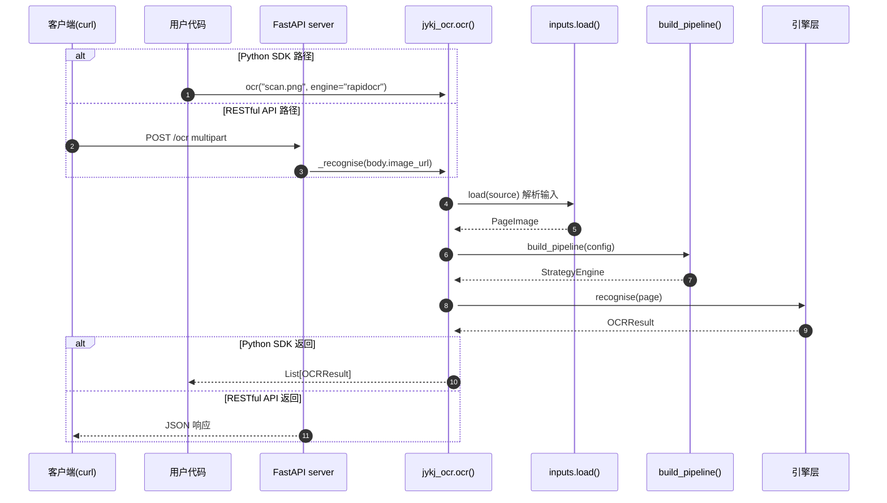

---

## 7. Python SDK

> 完整可运行示例见 `scripts/demo.py`(`python scripts/demo.py [图片路径]`),
> 四种场景一次跑通。

### 7.1 核心函数

```python
ocr(source: str, *,
   engine: str | None = None,
   config: Config | None = None,
   config_path: str | None = None,
   max_pages: int | None = None,
   dpi: int = 200,
   retries: int = 1,
   strategy_name: str | None = None) -> List[OCRResult]

ocr_to_text(source: str, ...) -> str
```

### 7.2 输入格式(`source` 参数)

`source` 支持三种形式:

| 形式 | 示例 | 说明 |
|------|------|------|
| 本地文件路径 | `"scan.png"`, `"/data/report.pdf"` | 图片(PNG/JPG/GIF/BMP/WebP/TIFF)或 PDF |
| HTTP URL | `"https://example.com/scan.png"` | 自动下载后识别,支持无扩展名 URL(魔数识别) |
| data URI | `"data:image/png;base64,xxxx"` | 内联图片字节,无需写盘 |

**不接受裸 bytes**。如需识别内存图片:

```python
import base64
payload = base64.b64encode(img_bytes).decode()
data_uri = f"data:image/png;base64,{payload}"
results = jykj_ocr.ocr(data_uri, engine="rapidocr")
```

### 7.3 输出结构(`OCRResult`)

`ocr()` 返回 `List[OCRResult]`,每个元素为一页:

```python
results = jykj_ocr.ocr("report.pdf", max_pages=2)
for page in results:
    print(f"--- 第 {results.index(page)+1} 页 ---")
    print(f"引擎: {page.engine}")        # "rapidocr"
    print(f"模型: {page.model}")         # "rapidocr-onnxruntime"
    print(f"耗时: {page.elapsed_ms}ms")
    print(f"尺寸: {page.width}×{page.height}")
    print(f"文本: {page.text}")
    for region in page.regions:
        print(f"  [{region.confidence:.2f}] {region.text}")
        print(f"    位置: {region.bbox.x1},{region.bbox.y1} - {region.bbox.x2},{region.bbox.y2}")
```

`OCRResult` 字段:

| 字段 | 类型 | 说明 |
|------|------|------|
| `text` | `str` | 该页识别的全文 |
| `regions` | `List[TextRegion]` | 各文本块(含 bbox/confidence) |
| `engine` | `str` | 实际使用的引擎 |
| `model` | `str` | 模型名(本地引擎为 onnx 版本号,远程为模型名) |
| `elapsed_ms` | `int` | 识别耗时(毫秒) |
| `width` / `height` | `int` | 页面像素尺寸 |
| `ok` | `bool` | 是否有可用文本 |

### 7.4 输出结构示意

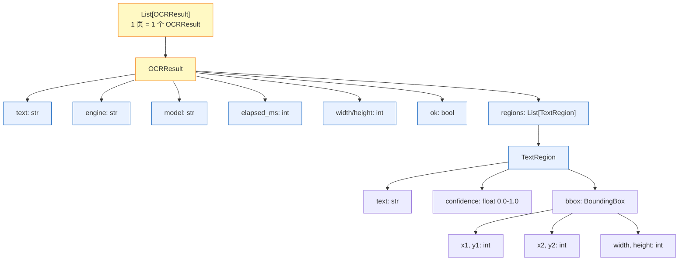

### 7.5 完整案例

#### 案例 1:离线识别单张图片

```python
import jykj_ocr

results = jykj_ocr.ocr("scan.png", engine="rapidocr")
for r in results:
    print(r.engine, r.model, len(r.regions), "regions")
    print(r.text)
```

#### 案例 2:识别 PDF 前 10 页,指定 DPI

```python
results = jykj_ocr.ocr("report.pdf", max_pages=10, dpi=300)
full_text = "\n\n".join(r.text for r in results)
print(f"共 {len(results)} 页,总计 {len(full_text)} 字")
```

#### 案例 3:远程识别(硅基流动)

```python
# 需提前设置 OPENAI_API_KEY
results = jykj_ocr.ocr("scan.png", engine="multimodal")
for r in results:
    print(f"引擎={r.engine} 模型={r.model} 区域数={len(r.regions)}")
    print(r.text)
```

#### 案例 4:使用命名预设(窜行自动降级 + 阅读顺序重排)

```python
results = jykj_ocr.ocr("stamp.png", strategy_name="quality")
# quality == seq-any:rapidocr 窜行时自动降级到 VL,并重排阅读顺序
```

#### 案例 5:最佳策略(所有引擎各跑一次,选最优)

```python
results = jykj_ocr.ocr("scan.png", strategy_name="bestof-smart")
# bestof-smart:置信度 × 100 − 窜行惩罚 + 文本长度 + 语义流畅度
```

#### 案例 6:只取拼接好的文本

```python
text = jykj_ocr.ocr_to_text("scan.png", engine="rapidocr")
print(text)   # 纯文本,无 JSON 包裹
```

#### 案例 7:用 data URI 识别内存图片

```python
import base64
with open("scan.png", "rb") as f:
    payload = base64.b64encode(f.read()).decode()
data_uri = f"data:image/png;base64,{payload}"
results = jykj_ocr.ocr(data_uri, engine="rapidocr")
```

---

## 8. RESTful API

### 8.1 启动服务

```bash
python -m jykj_ocr serve --port 8000
# 或
JYKJ_OCR_PORT=8000 python -m uvicorn jykj_ocr.server:app --host 0.0.0.0
```

启动后访问 `http://localhost:8000/docs` 查看交互式 Swagger 文档。

### 8.2 端点一览

| 方法 | 路径 | 输入方式 | 输出结构 |
|------|------|----------|:---:|
| `POST` | `/ocr` | multipart 上传文件 | ✅ 统一(见 §8.4) |
| `POST` | `/ocr/{preset}` | multipart 上传文件 | ✅ 统一(见 §8.4) |
| `POST` | `/ocr/text` | JSON body | ✅ 统一(见 §8.4) |
| `POST` | `/ocr/{preset}/text` | JSON body | ✅ 统一(见 §8.4) |
| `GET` | `/config` | — | ❌ 单独结构 |
| `POST` | `/config` | JSON body(运行时覆盖) | ❌ 单独结构 |
| `DELETE` | `/config` | — | ❌ 单独结构 |
| `GET` | `/health` | — | ❌ `{status, engines}`(`engines` 是去重到**引擎类型**的列表,与配置条目数无关;要看实例级条目请查下一行的 `configured`) |
| `GET` | `/engines` | — | ❌ `{engines, configured}`(`engines` 类型表 / `configured` 实例级条目) |
| `GET` | `/presets` | — | ❌ `{presets}`(见 §9.1.1;每项含 `min_engines` 引擎个数下限) |

**四个 OCR 端点返回结构完全一致**(`{pages, text, engine, page_count, score, score_mode, decision}`)。只有 `format=text`/`markdown` 时退化为纯文本。`{preset}` 路径参数见 §9.1(命名策略预设)。

### 8.3 输入格式

#### 8.3.1 multipart 上传(`POST /ocr`、`POST /ocr/{preset}`)

**表单字段**:

| 字段 | 类型 | 必填 | 说明 |
|------|------|:----:|------|
| `file` | File | ✅ | 图片或 PDF 文件 |
| `engine` | string | — | 强制指定引擎(如 `rapidocr`/`multimodal`) |
| `model` | string | — | 覆盖模型名(仅远程引擎生效) |
| `base_url` | string | — | 覆盖平台端点(仅远程引擎生效),留空时回退 `OPENAI_BASE_URL_<N>` → `OPENAI_BASE_URL` → `JYKJ_OCR_<NAME>_BASE_URL` |
| `api_key` | string | — | 覆盖凭据(仅远程引擎生效),留空时回退 `JYKJ_OCR_<NAME>_<N>_API_KEY` → `MULTIMODAL_<N>_API_KEY` → `JYKJ_OCR_MULTIMODAL_API_KEY` → `MULTIMODAL_API_KEY` → `OPENAI_API_KEY` |
| `prompt` | string | — | 覆盖 prompt(仅远程引擎生效) |
| `strategy` | JSON string | — | 临时策略对象(如 `{"retry_mode":"any","max_retries":2}`) |
| `strategy_name` | string | — | 一次性命名预设:`local`/`vl`/`seq*`/`bestof*` |
| `max_pages` | int | — | PDF 页数上限 |
| `dpi` | int | 200 | PDF 渲染 DPI |
| `format` | string | json | 输出格式:`json`/`text`/`markdown` |

**数据流**:

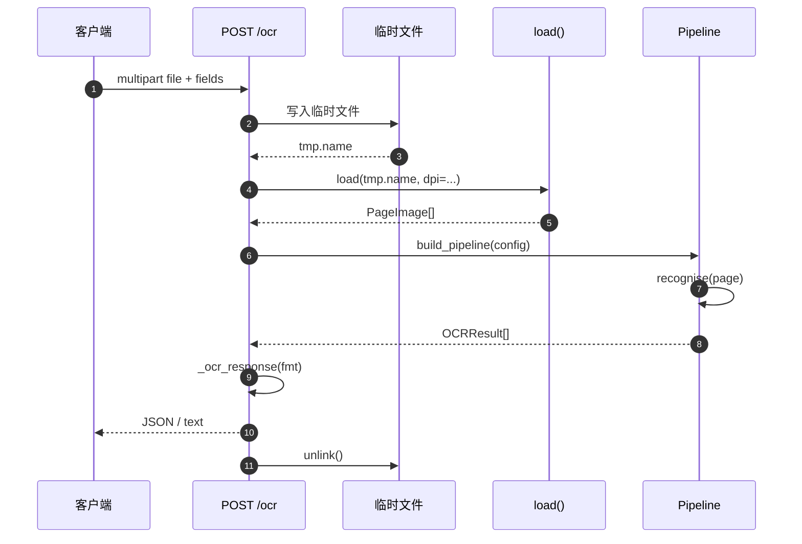

**示例**:

```bash
# 上传本地图片,指定引擎和输出格式
curl -s http://localhost:8000/ocr \
  -F "file=@scan.png" \
  -F "engine=multimodal" \
  -F "format=json"

# 上传 PDF,只处理前 5 页,300 DPI
curl -s http://localhost:8000/ocr \
  -F "file=@report.pdf" \
  -F "max_pages=5" \
  -F "dpi=300"

# 使用命名预设路由:所有引擎择优
curl -s http://localhost:8000/ocr/bestof \
  -F "file=@scan.png" \
  -F "format=json"

# 路由 + 覆盖模型
curl -s http://localhost:8000/ocr/multimodal \
  -F "file=@scan.png" \
  -F "model=Qwen/Qwen2.5-VL-72B" \
  -F "format=text"
```

#### 8.3.2 JSON body(`POST /ocr/text`、`POST /ocr/{preset}/text`)

**图片来源(三选一,只能传一个)**:

| 字段 | 类型 | 说明 |
|------|------|------|
| `image_url` | string | 本地路径或 `http(s)://` URL |
| `image_b64` | string | 纯 base64 字符串(自动加 `data:` 前缀) |
| `image_data` | string | 完整 data URI,如 `data:image/png;base64,xxxx` |

**通用字段**:

| 字段 | 类型 | 默认 | 说明 |
|------|------|:----:|------|
| `engine` | string | — | 强制引擎 |
| `model` | string | — | 覆盖模型(仅远程引擎) |
| `prompt` | string | — | 覆盖 prompt(仅远程引擎) |
| `strategy` | object | — | 临时策略 JSON 对象 |
| `strategy_name` | string | — | 一次性命名预设 |
| `max_pages` | int | — | PDF 页数上限 |
| `dpi` | int | 200 | PDF 渲染 DPI |
| `format` | string | `json` | 输出格式 |

**三选一校验流程**:

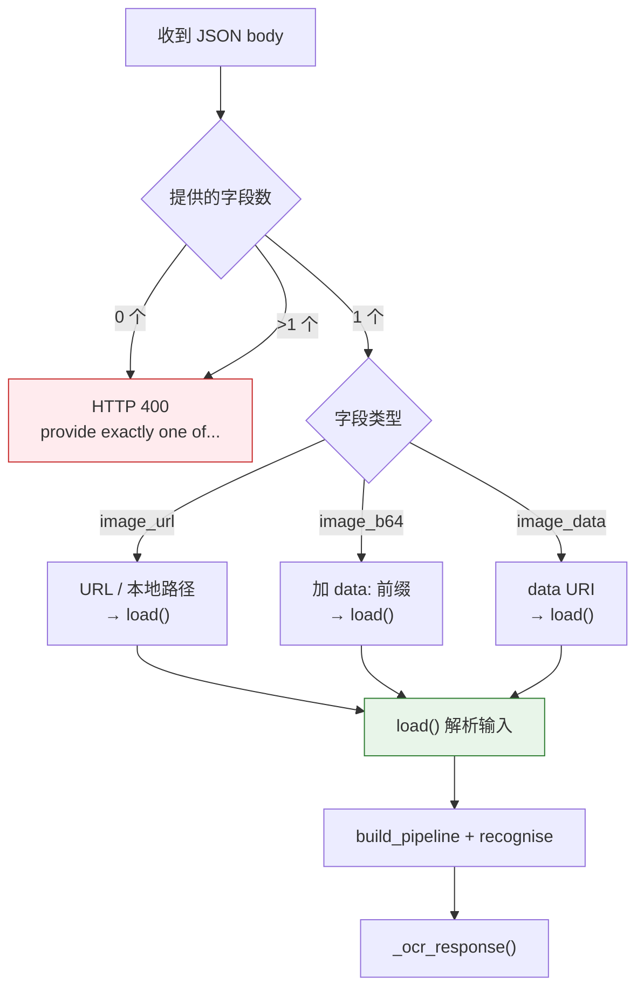

**示例**:

```bash
# 按 URL 识别(最常用)
curl -s http://localhost:8000/ocr/text \
  -H "Content-Type: application/json" \
  -d '{"image_url":"https://example.com/scan.png","engine":"multimodal","format":"json"}'

# URL 无扩展名也能识别(按文件头魔数自动判型)
curl -s http://localhost:8000/ocr/text \
  -H "Content-Type: application/json" \
  -d '{"image_url":"https://example.com/img/u=1234&fm=3074","strategy_name":"vl"}'

# 传 base64 字符串
curl -s http://localhost:8000/ocr/text \
  -H "Content-Type: application/json" \
  -d '{"image_b64":"iVBORw0KGgoAAAANSUhEUgAA...","engine":"rapidocr"}'

# 传完整 data URI
curl -s http://localhost:8000/ocr/text \
  -H "Content-Type: application/json" \
  -d '{"image_data":"data:image/png;base64,iVBORw0KGgoAAA...","engine":"rapidocr"}'

# 路由即策略:用 bestof 预设,base64 输入
curl -s http://localhost:8000/ocr/bestof/text \
  -H "Content-Type: application/json" \
  -d '{"image_b64":"iVBORw0KGgoAAA...","format":"json"}'

# 本地文件路径(容器环境挂载共享目录时可用)
curl -s http://localhost:8000/ocr/text \
  -H "Content-Type: application/json" \
  -d '{"image_url":"/data/scan.png","engine":"rapidocr"}'
```

> **注意**:三个图片来源字段只能传一个,传零个或传多个都会返回 HTTP 400
> `{"detail":"provide exactly one of image_url, image_b64, or image_data"}`。

### 8.4 输出格式

#### 8.4.1 JSON 格式(`format=json`,默认)

所有四个 OCR 端点返回**完全相同**的结构:

```json
{
  "pages": [
    {
      "text": "永和九年,岁在癸丑,暮春之初...",
      "engine": "rapidocr",
      "model": "rapidocr-onnxruntime",
      "elapsed_ms": 10286,
      "width": 750,
      "height": 1390,
      "region_count": 166,
      "regions": [
        {
          "text": "永和九年岁在癸丑",
          "confidence": 0.97,
          "bbox": {
            "x1": 672,
            "y1": 12,
            "x2": 737,
            "y2": 1370,
            "width": 65,
            "height": 1358
          },
          "engine": "rapidocr"
        }
      ]
    }
  ],
  "text": "永和九年,岁在癸丑...\n\n(多页时用双换行拼接)",
  "engine": "rapidocr",
  "page_count": 1,
  "score": null,
  "score_mode": "",
  "decision": null
}
```

> **顶层的 `score` / `score_mode` / `decision`** 与 `pages[0]` 里的同名字段相同——
> 一条 pipeline 服务所有页,策略判定对每页都一样,顶层是便捷副本,`pages[]` 里仍保留
> 完整一份。单引擎直连(`/ocr?engine=rapidocr`)不走策略,这三个字段为 `null` / 空串。

**字段说明**:

| 字段 | 类型 | 说明 |
|------|------|------|
| `pages` | array | 每页一个对象;单图也是 1 个元素 |
| `pages[].text` | string | 该页识别全文 |
| `pages[].engine` | string | 该页最终使用的引擎名 |
| `pages[].model` | string | 模型名(本地引擎为 onnx 版本号,远程为模型名) |
| `pages[].elapsed_ms` | int | 该页识别耗时(毫秒) |
| `pages[].width` / `height` | int | 页面像素尺寸 |
| `pages[].region_count` | int | 文本区域数量 |
| `pages[].regions` | array | 每个文本区域的详细信息 |
| `pages[].regions[].text` | string | 该区域的文字 |
| `pages[].regions[].confidence` | float | 置信度 0.0–1.0 |
| `pages[].regions[].bbox` | object | 边界框(含 x1/y1/x2/y2/width/height) |
| `pages[].regions[].engine` | string | 识别该区域的引擎 |
| `pages[].score` | float / null | 该页结果的策略分数(bestof 为赢家得分,seq 为平均置信度×100);单引擎直连为 `null` |
| `pages[].score_mode` | string | 打分口径(`smart`/`fastest`/`highest_confidence`/`longest`/`fluency`;seq 家族为 `mean_confidence`) |
| `pages[].decision` | object / null | 策略判定轨迹,见下方小节 |
| `text` | string | 所有页拼接后的完整文本 |
| `engine` | string | 最终使用的引擎(单页时等于 `pages[0].engine`) |
| `page_count` | int | 页数 |
| `score` / `score_mode` / `decision` | float / string / object | 顶层便捷副本,等于 `pages[0]` 的同名字段 |

**输出结构示意**:

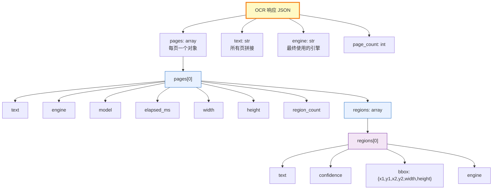

**多页 PDF 示例**:

```json
{
  "pages": [
    {
      "text": "第一章 引言",
      "engine": "rapidocr",
      "model": "rapidocr-onnxruntime",
      "elapsed_ms": 8500,
      "width": 595,
      "height": 842,
      "region_count": 42,
      "regions": [...]
    },
    {
      "text": "第二章 方法",
      "engine": "rapidocr",
      "model": "rapidocr-onnxruntime",
      "elapsed_ms": 9200,
      "width": 595,
      "height": 842,
      "region_count": 58,
      "regions": [...]
    }
  ],
  "text": "第一章 引言\n\n第二章 方法",
  "engine": "rapidocr",
  "page_count": 2
}
```

#### 8.4.2 `decision` 字段详解

`decision` 的形状取决于走的是哪条策略链。

**`StrategyEngine`(seq / cascade / fallback / quality / local / vl)** —
`reason` 是 `first_accepted`(首个候选命中重试判定)或 `all_rejected_fallback`(全被拒,返回最后一条);
`accepted` / `rejected` 里每条都带同一套指标,可以直接看出「因为什么才被降级」:

```json
{
  "selected": "multimodal",
  "reason": "first_accepted",
  "engine_order": ["rapidocr", "multimodal"],
  "retries": 1,
  "accepted": [{
    "engine": "multimodal", "model": "PaddleOCR-VL-1.5",
    "attempt": 1, "own_elapsed_ms": 3709, "ok": true,
    "mean_confidence": 1.0, "region_count": 1, "char_count": 324,
    "garbled_layout": false
  }],
  "rejected": [{
    "engine": "rapidocr", "model": "rapidocr-onnxruntime",
    "attempt": 1, "own_elapsed_ms": 20234, "ok": true,
    "mean_confidence": 0.9108, "region_count": 166, "char_count": 488,
    "garbled_layout": true
  }],
  "fallback": false,
  "total_elapsed_ms": 23943
}
```

上面这条 `rejected` 里 `garbled_layout: true` 就是 `/ocr/seq-any` 把它换掉的原因——
窜行检出,配合 `retry_mode=any` 降级到 VL。`attempt` 是该引擎的第几次尝试,
`own_elapsed_ms` 是引擎自身耗时(区别于 `total_elapsed_ms`——后者含被拒与重试的全部
墙钟时间)。`cascade*` 家族的差别只在于 `retries` 是 `0`,被拒的候选直接进 `rejected`
数组、立刻换下一个引擎,不再重试同一引擎。任何引擎抛异常时,`errors` 是
`[{engine, error}]`,**异常不使整次请求失败**——其余候选照常参与判定。

**`BestofEngine`(bestof / bestof-smart / bestof-fastest / bestof-confidence /
bestof-longest / bestof-fluency / `bestof:<mode>`)** — `ranked` 数组给出每个候选的
完整评分,`detail` 按所用打分口径拆到分量。硅基流动实测
(`moonshotai/Kimi-K2.7-Code` + `PaddlePaddle/PaddleOCR-VL-1.5` + 本地 rapidocr):

```json
{
  "selected": "multimodal",
  "reason": "highest_smart_score",
  "score_mode": "smart",
  "engine_order": ["rapidocr", "multimodal", "multimodal"],
  "total_elapsed_ms": 204007,
  "ranked": [
    {
      "engine": "multimodal", "model": "PaddlePaddle/PaddleOCR-VL-1.5", "ok": true,
      "score": 116.0, "mean_confidence": 1.0, "region_count": 1,
      "char_count": 324, "garbled_layout": false, "own_elapsed_ms": 3709,
      "detail": {
        "confidence_pts": 100.0, "garbled_penalty": 0.0, "length_nudge": 1.0,
        "phrase_bonus": 15.0, "punct_bonus": 0.0, "frag_penalty": 0.0,
        "single_chars": 0, "mean_phrase_len": 324.0
      }
    },
    {
      "engine": "rapidocr", "model": "rapidocr-onnxruntime", "ok": true,
      "score": 49.0305, "mean_confidence": 0.9108, "region_count": 166,
      "char_count": 488, "garbled_layout": true, "own_elapsed_ms": 20234,
      "detail": {
        "confidence_pts": 91.084, "garbled_penalty": -20.0, "length_nudge": 1.0,
        "phrase_bonus": 1.946, "punct_bonus": 0.0, "frag_penalty": 25.0,
        "single_chars": 122, "mean_phrase_len": 1.95
      }
    }
  ],
  "errors": [
    {"engine": "multimodal", "error": "EngineError: multimodal timed out after 180s"}
  ]
}
```

`smart` 口径的读数:`PaddleOCR-VL-1.5` 是整段连续输出,`mean_phrase_len` 324 直接顶到
短语长度奖赏的上限 15;`rapidocr` 122 个单字碎片 + 窜行,`garbled_penalty` −20 与
`frag_penalty` 25 加起来吃掉 45 分,尽管它的 `char_count` 更长(488 vs 324)、
`confidence_pts` 也不低,总分仍只有 49.03。第三条 `multimodal`
(`moonshotai/Kimi-K2.7-Code`)因响应超过 180s 进入 `errors`,不计入 `ranked`。

`bestof-*` 各自的 `detail` 只报自己读的那一项:`highest_confidence` 报
`mean_confidence`,`longest` 报 `char_count`,`fastest` 报 `own_elapsed_ms`,
`fluency` 报 `phrase_bonus` / `punct_bonus` / `frag_penalty` / `single_chars` /
`mean_phrase_len`;`smart` 报 `confidence_pts` + `garbled_penalty` + `length_nudge`
再拼上同一套 fluency 分量(因为 smart 就是把流畅度加权进总分)。各分量的上限是:
`phrase_bonus` ≤ 15(平均短语长度,30 字符封顶前的线性段)、`punct_bonus` ≤ 5(CJK 标点比例)、
`frag_penalty` ≤ 25(单字碎片数 × 0.3,封顶)、`garbled_penalty` 固定 −20。

单引擎直连(`/ocr?engine=rapidocr`)不走任何策略,`score` / `score_mode` / `decision`
分别是 `null` / `""` / `null`。

#### 8.4.3 text / markdown 格式(`format=text` 或 `format=markdown`)

直接返回拼接后的纯文本(每个页面的 markdown 卡片用双换行拼接),
无 JSON 包裹,`Content-Type: text/plain`:

```text
# 识别结果 - 第 1 页

- **engine**: rapidocr
- **model**: rapidocr-onnxruntime
- **elapsed_ms**: 10286
- **size**: 750 × 1390
- **regions**: 166

## 文本

永和九年,岁在癸丑,暮春之初,会于会稽山阴之兰亭...
```

两种格式内容完全相同,`text` 和 `markdown` 可互换使用。

### 8.5 完整案例

#### 案例 1:上传文件,JSON 输出

```bash
curl -s -X POST http://localhost:8000/ocr \
  -F "file=@tests/兰亭序.jpeg" \
  -F "engine=rapidocr" \
  -F "format=json"
```

```json
{
  "pages": [{
    "text": "永和九年岁在癸丑...",
    "engine": "rapidocr",
    "model": "rapidocr-onnxruntime",
    "elapsed_ms": 10286,
    "width": 750,
    "height": 1390,
    "region_count": 166,
    "regions": [
      {"text": "永和九年岁在癸丑", "confidence": 0.97, "bbox": {...}, "engine": "rapidocr"}
    ]
  }],
  "text": "永和九年岁在癸丑...",
  "engine": "rapidocr",
  "page_count": 1
}
```

#### 案例 2:URL 识别,markdown 输出

```bash
curl -s -X POST http://localhost:8000/ocr/text \
  -H "Content-Type: application/json" \
  -d '{
    "image_url": "https://example.com/scan.png",
    "engine": "multimodal",
    "format": "markdown"
  }'
```

```text
# 识别结果 - 第 1 页

- **engine**: multimodal
- **model**: PaddlePaddle/PaddleOCR-VL-1.5
- **elapsed_ms**: 8500
- **size**: 800 × 1200
- **regions**: 24

## 文本

永和九年,岁在癸丑,暮春之初...
```

#### 案例 3:base64 识别,JSON 输出

```bash
curl -s -X POST http://localhost:8000/ocr/text \
  -H "Content-Type: application/json" \
  -d '{
    "image_b64": "iVBORw0KGgoAAAANSUhEUgAA...",
    "engine": "rapidocr",
    "format": "json"
  }'
```

#### 案例 4:策略预设路由 + 临时覆盖

```bash
curl -s -X POST http://localhost:8000/ocr/bestof \
  -F "file=@scan.png" \
  -F "model=Qwen/Qwen2.5-VL-72B" \
  -F "format=json"
```

路由参数 `bestof` 指定"所有引擎各跑一次,按 smart 评分选最佳";
`model` 覆盖远程引擎的模型为 Qwen2.5-VL-72B。

#### 案例 5:运行时调整策略 + 按 URL 识别

```bash
# 先调整策略:降低置信度阈值,增大重试次数
curl -s -X POST http://localhost:8000/config \
  -H "Content-Type: application/json" \
  -d '{"strategy": {"retry_mode": "low_confidence", "min_confidence": 0.6, "max_retries": 2}}'

# 再识别,自动应用新策略
curl -s http://localhost:8000/ocr/text \
  -H "Content-Type: application/json" \
  -d '{"image_url": "https://example.com/blurry.png", "engine": "rapidocr"}'
```

### 8.6 运行时配置 `GET/POST/DELETE /config`

不重启改模型或引擎顺序:

```bash
# 查看当前配置(不泄露 key)
curl -s http://localhost:8000/config
```

```json
{
  "engines": [
    {"name": "rapidocr", "enabled": true, "model": "", "base_url": ""},
    {"name": "multimodal", "enabled": true, "model": "PaddlePaddle/PaddleOCR-VL-1.5", "base_url": "https://api.siliconflow.cn/v1"},
    {"name": "multimodal", "enabled": false}
  ],
  "strategy": {"max_retries": 1, "retry_mode": "no_text", "min_confidence": 0.7},
  "has_api_key": true,
  "overridden": false
}
```

```bash
# 切换模型(不回显 key)
curl -s -X POST http://localhost:8000/config \
  -H "Content-Type: application/json" \
  -d '{"engines":[{"name":"multimodal","model":"Qwen/Qwen2.5-VL-72B"}]}'

# 调整策略
curl -s -X POST http://localhost:8000/config \
  -H "Content-Type: application/json" \
  -d '{"strategy":{"max_retries":2,"retry_mode":"low_confidence","min_confidence":0.8}}'

# 还原到 config.yaml 默认值
curl -s -X DELETE http://localhost:8000/config
```

> `GET /config` 永远只返回 `has_api_key: true/false` 布尔值,绝不返回 key 明文。
> 离线引擎(rapidocr)不读 URL / 模型 / key,所以它的 `model` 与 `base_url` 恒为空串、
> `has_api_key` 恒为 `false`——即使同一条 `OPENAI_BASE_URL` / `OPENAI_API_KEY` 环境变量
> 已经解析出来了。否则会误导成「本地引擎也在打远程接口」。字段始终存在,只是值为空,
> 客户端无需按引擎类型分支取值。

### 8.7 辅助端点

```bash
# 健康检查
curl -s http://localhost:8000/health
# {"status":"ok","engines":["rapidocr","multimodal"]}

# 引擎列表
curl -s http://localhost:8000/engines
# {"engines":{"rapidocr":"本地 RapidOCR (ONNX),无需 API key,离线可用",
#             "multimodal":"OpenAI 兼容多模态端点(硅基流动 / 百炼 / 火山 / vLLM 等任意平台,可配置多个实例)"},
 "configured":[{"name":"rapidocr","resolved_name":"rapidocr","enabled":true,"model":"","base_url":""},
              {"name":"multimodal","resolved_name":"multimodal","enabled":true,
               "model":"PaddleOCR-VL-1.5","base_url":"https://api.moark.com/v1"}]}
# configured 是实例级列表:每个 multimodal 条目各占一行,带 model/base_url 指纹,便于区分同名引擎
# 本地引擎不读 URL/模型,key,所以 model 与 base_url 恒为空串(不会因为共享的
# OPENAI_BASE_URL 而带上一个它从不使用的端点)

# 全部命名预设(18 项,含 bestof:<mode> 别名)
curl -s http://localhost:8000/presets
# 每项带 retry_mode / reorder_lines / is_bestof / score_mode / engine_scope,
# 以及 min_engines——该预设要求的已启用引擎个数下限(null 表示不限)
```

### 8.8 异常映射

所有异常统一返回 `{"detail": "错误描述"}` 格式。

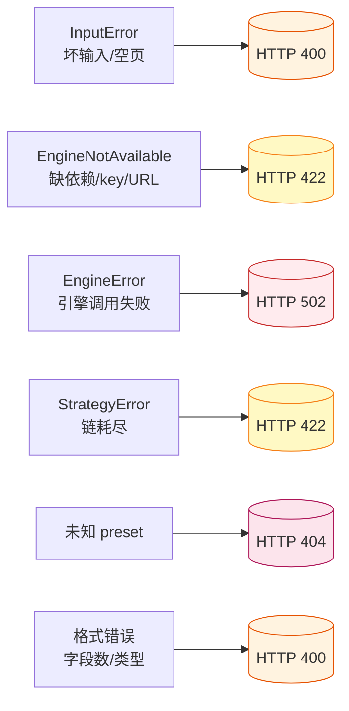

| 异常 | HTTP 状态码 | 典型场景 | 响应示例 |
|------|:----:|------|------|
| `InputError` | 400 | 文件不存在、图片损坏、URL 无法下载、base64 解码失败 | `{"detail":"input not found: /tmp/x.png"}` |
| `EngineNotAvailable` | 422 | 缺少依赖库、API key 为空、base_url 未配置 | `{"detail":"multimodal requires OPENAI_API_KEY"}` |
| `EngineError` | 502 | 引擎调用超时、HTTP 402 余额不足、网络错误 | `{"detail":"HTTP 402","engine":"multimodal"}` |
| `StrategyError` | 422 | 策略链中所有引擎均失败且无可用结果;或预设要求的引擎数不足(见 §9.1.1) | `{"detail":"strategy 'bestof' needs at least 2 engine(s), but only 1 is/are enabled: rapidocr"}` |
| 未知 preset | 404 | `/ocr/xxx` 路由既非引擎也非策略预设 | `{"detail":"unknown preset 'xxx'..."}` |
| 格式错误 | 400 | 图片三选一只传一个、format 非法、strategy JSON 非对象 | `{"detail":"provide exactly one of image_url, image_b64, or image_data"}` |

---

## 9. 策略预设

### 9.1 策略模型总览

jykj_ocr 提供**三个**策略家族(底层只有两个引擎:顺序与级联共用 `StrategyEngine`,
最佳走 `BestofEngine`),解决不同场景:

| 策略家族 | 引擎调用方式 | 何时选它 |
|----------|--------------|----------|
| **顺序预设**(`local`/`vl`/`seq*`/`fallback`/`quality`) | 按 `config.engines` 顺序一个接一个尝试,**第一个命中即返回**;不通过再试下一个 | 日常生产:引擎 A 能用就用 A,失败才降级到 B——快,省钱 |
| **级联预设**(`cascade*`) | 与 `seq*` **同一个** `StrategyEngine`,唯一区别 `max_retries=0`——被 reject 的尝试立刻降级下一引擎,不重扫同一张 | 本地明显不行时(如盖章窜行)不值得重试:直接把时间省给远程 |
| **最佳预设**(`bestof`/`bestof-*`) | **所有引擎各跑一次**,按评分函数挑得分最高的那一个 | 对质量要求极高:不在乎多花几倍时间,只要结果最好 |

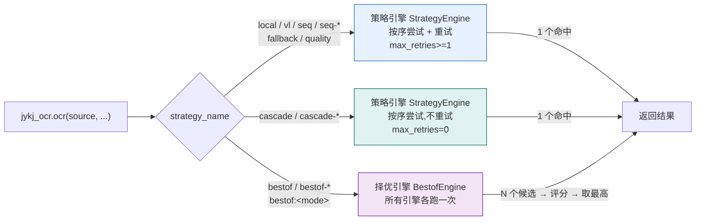

#### 9.1.1 引擎个数下限

`seq*` / `cascade*` / `bestof*` 要求**至少 2 个已启用引擎**,不足直接报
`StrategyError`(HTTP 422 / CLI 退出 1),不会返回一个「看起来很正常的单引擎结果」:
`bestof` 只有 1 个候选时,评分赢的是一个从不存在的对手;`seq` 只有 1 个引擎时,
`decision.engine_order` 是一条从不分叉的链,看不出配置是否真的按预期工作。

豁免的是 `local` 与 `vl`:`local` 的单引擎部署就是 `config/config.local.yaml`,是合法
形态而非配置错误;`vl` 保证保留 1 条远程引擎,数量不足时它自己报 `ValueError`。

```
GET /presets
{"presets": {
  "local":  {"min_engines": null, ...},   // 不限
  "vl":     {"min_engines": 1, ...},      # 由预设自身逻辑保证
  "seq":    {"min_engines": 2, ...},
  "bestof-fluency": {"min_engines": 2, ...}
}}
```

下限可由 `JYKJ_OCR_MIN_ENGINES` 调整(1..99,默认 2,非法值钳位),但**只放宽
`seq*` / `cascade*`**——`bestof*` 恒为 2,因为那个旋钮是为放宽顺序链准备的,不是用来
关掉候选对比的。

不受约束的情形:

- `--engine` / `engine=xxx` 强制单个引擎——那是直连,不是策略
- 不指定任何预设、也没设 `bestof_mode` 的默认链——按配置里的引擎顺序原样跑
- `strategy.bestof_mode` 旋钮单独出现(没有预设名)——同样走 `build_pipeline` 里的
  同一条检查,结果一致

### 9.2 顺序与级联预设(`seq*` / `cascade*`,走 `StrategyEngine`)

**工作机制**:引擎按 `config.engines` 数组顺序排列,从第一个开始 `recognise()`;
结果通过 `retry_check` 谓词(见 §9.4)判定是否合格——合格即返回,不合格才切换下一个。
每个引擎最多重试 `max_retries` 次。

`cascade*` 与 `seq*` **共用同一个 `StrategyEngine`**,唯一区别是 `max_retries=0`:
被 reject 的尝试立刻降级到下一个引擎,不重试同一引擎。本地 OCR 对同一张图
重跑不会变好(盖章窜行再扫一遍还是窜行),这时用 `cascade*` 省下重复开销。

**建议的引擎顺序**(对预设效果影响最大,建议放错就白等):

1. **`rapidocr` 放第一位** —— 离线、零凭据、~10s 一页。它命中时成本是 0。
2. **第二条远程放快模型** —— `PaddlePaddle/PaddleOCR-VL-1.5`(3~5s)。作为
   第一层降级,让降级路径也不慢。
3. **第三条远程放慢模型** —— `Qwen/Qwen3-VL-30B-A3B-Instruct`(自动分段、
   文本整理最佳,~12s)或 `Qwen/Qwen3-VL-8B-Instruct`(省 token 兜底)。
4. **别放代码/对话 Agent 模型**(`Kimi-K2.7-Code`、`GLM-4.5V` 一类)当常规条目 ——
   实测 140s+ 且带幻觉前缀,会把整条链拖到超时。见 §9.8。
5. **本地引擎放最前**,远程按「快→慢」排。顺序反过来(rapidocr 在最后)时
   `seq` 会先去打远程,慢一个数量级。

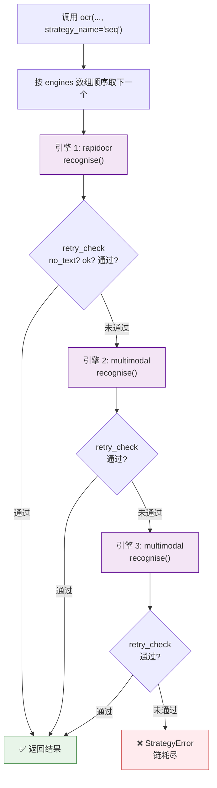

**各预设细节**:

| 预设 | 引擎范围 | retry_mode | 重排 | 建议模型 / 场景 |
|------|----------|:---:|:---:|-----------------|
| `local` | 仅本地(rapidocr 家族) | `no_text` | — | 只能有 rapidocr。**离线/隐私/批量化**:涉密文件、内网无出口、一次上千页 |
| `vl` | 仅 1 条远程 VL(第一条已启用的) | `no_text` | — | 建议 `PaddlePaddle/PaddleOCR-VL-1.5` 或 `Qwen3-VL-30B`。**本地必然烂的图**:手写、盖章、拍照倾斜、表格 |
| `seq` | 全部启用引擎 | `no_text` | — | rapidocr → 快 VL。**通用生产默认**:大多数图本地够用,偶尔才降级 |
| `seq-any` | 同 seq + 窜行降级 | `any` | ✅ | 同 `seq`,但多一层保险。**盖章、倾斜、双栏**导致 rapidocr 窜行 |
| `seq-low_conf` | 全部启用引擎 | `low_confidence` | — | 同 `seq`,阈值默认 **0.7**。**对准确率敏感**:模糊、低对比度、小字 |
| `seq-line_overlap` | 全部启用引擎 | `line_overlap` | — | 同 `seq`,只看窜行。**只关心版面顺序**,不在乎置信度 |
| `cascade` | 同 seq | `no_text` | — | 同 seq,**但 `max_retries=0`**:被 reject 立刻换引擎,不重扫同一张 |
| `cascade-low_conf` | 同 seq | `low_confidence` | — | 同上 |
| `cascade-line_overlap` | 同 seq | `line_overlap` | — | 同上。**快速兜底链**:本地窜行就立刻上远程,不浪费一次重跑 |
| `fallback` | 同 `seq` | `no_text` | — | legacy 别名,行为等同 `seq` |
| `quality` | 同 `seq-any` | `any` | ✅ | legacy 别名,行为等同 `seq-any`(窜行降级 + 重排) |

> `cascade*` 与对应 `seq*` 的差别只在 `max_retries`。retry_mode 完全相同(见
> `GET /presets` 的 `retry_mode` 字段),所以**选谁看的是"重试有没有用"**,不是
> "判定标准"。

**`seq` vs `cascade` 怎么选**:同一条引擎链,区别只是被 reject 后要不要
重跑同一个引擎。

- **选 `seq*`**:结果可能受网络抖动或限流影响 —— 远程 VL 偶尔返回空,重试
  一次大概率就好。
- **选 `cascade*`**:结果取决于图片本身 —— 盖章导致 rapidocr 窜行,再扫一遍
  还是窜行;这时重试只是浪费 ~10s。本次实测 `cascade-line_overlap` 11.0s
  完成,`seq-line_overlap` 20.4s(差出的 ~9s 就是一次 rapidocr 重跑)。

**引擎个数下限**:`seq*` / `cascade*` 要求 ≥2 个已启用引擎,不足返回 422
并列出实际启用的引擎名(见 §9.1.1)。`local` / `vl` 豁免。

**示例**:

```python
# 通用生产:rapidocr 优先,失败才降级
results = jykj_ocr.ocr("scan.png")              # 默认 seq

# 仅本地引擎(离线场景)
results = jykj_ocr.ocr("scan.png", strategy_name="local")

# 窜行自动降级 + 阅读顺序重排
results = jykj_ocr.ocr("stamp.png", strategy_name="quality")

# HTTP 端点
curl -s http://localhost:8000/ocr/quality \
  -F "file=@scan.png" -F "format=json"
curl -s http://localhost:8000/ocr/vl \
  -F "file=@scan.png" -F "format=json"
```

**阅读顺序重排**(仅 `seq-any`/`quality` 开启):当检测到窜行时,`rebuild_text_from_regions()`
按 bbox 的 `y1` 升序、同行内按 `x1` 升序重排所有 `TextRegion`,让输出"读起来像人话"。

**`seq*` 与 `cascade*` 的差别(同一套判定,只差重试)**:

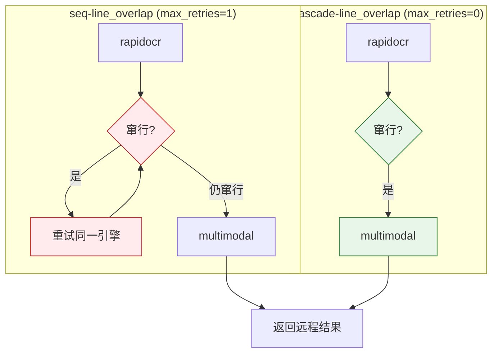


### 9.3 最佳预设(`bestof*`,走 `BestofEngine`)

**工作机制**:所有已启用引擎**各跑一次**(同步 for-loop,不并发),拿到 N 个
候选结果后,按评分函数打分,**返回得分最高的那一个**。

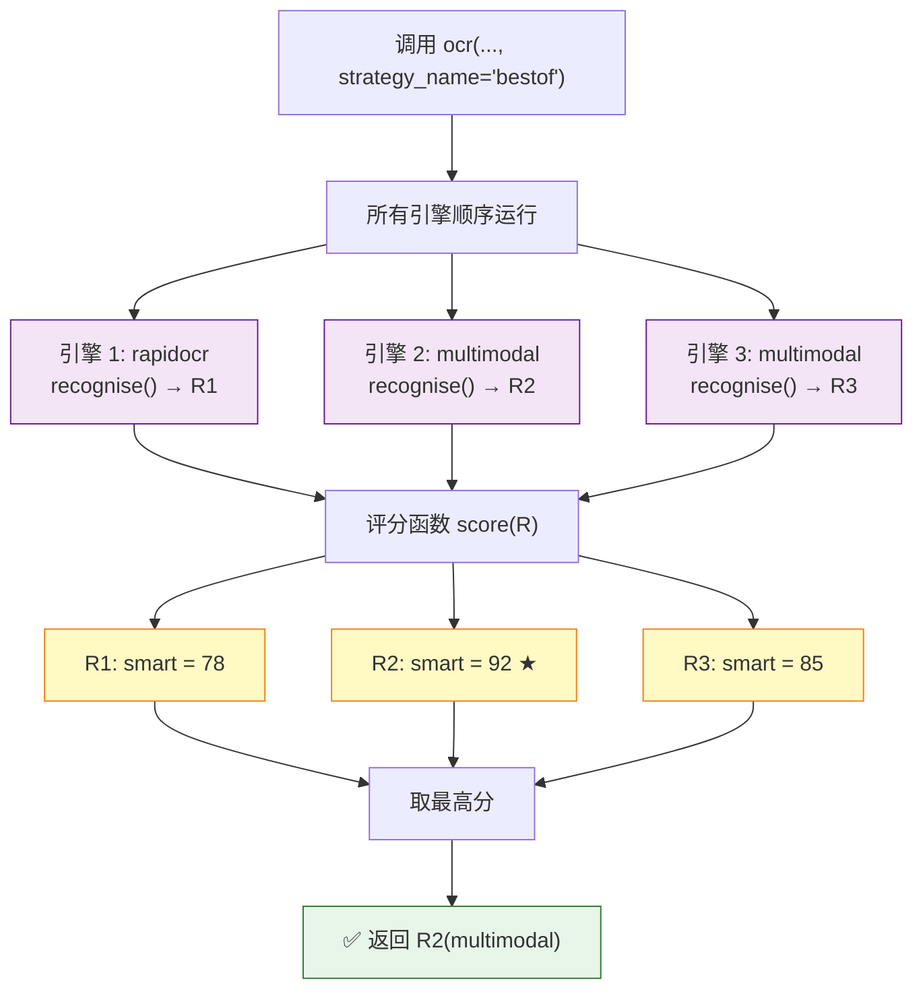

**各评分模式详解**:

| 预设 | 评分函数 | 得分公式 | 建议模型 / 场景 |
|------|----------|----------|-----------------|
| `bestof` / `bestof-smart` | **综合最优**(**推荐**) | `置信度 × 100 − 窜行惩罚 20 + 文本长度上限 1 + 语义流畅度` | rapidocr + 快 VL。**通用质量最优**,自动规避碎片化输出 |
| `bestof-fastest` | 最快 | `−elapsed_ms`(数值越小越好) | **注意**:比的是各引擎**耗时**,不是配置顺序。远程抖动时赢家会变(见下方警告) |
| `bestof-confidence` | 置信度最高 | `mean(confidence)` | 建议 rapidocr 做对照。**逐字准确**,适合需要原文精确核对的场景 |
| `bestof-longest` | 文本最长 | `len(text)` | **陷阱**:碎片化输出也可能很长。要"不漏字"请配 `smart`,不要单独用这个 |
| `bestof-fluency` | 语义流畅度 | `短语密度 + CJK 标点 − 单字碎片惩罚` | 建议 `Qwen3-VL-30B`(自动分段)。**追求"读起来像人话"**,适合要直接给人读的文本 |
| `bestof:<mode>` | 同上任意 mode | 等价于 `bestof-mode` | 冒号语法别名 |

> **成本警告**:`BestofEngine` 是**串行**的(同步 for-loop,不并发),3 个引擎
> 的最坏耗时 = 3 × `timeout`。配置里远程 `timeout: 180` 时,一次 `bestof*`
> 调用最坏要等 ~9 分钟。本次实测 3 个候选全部完成、无超时,耗时
> 110s / 121s / 154s;个别轮次 Kimi 撞上 180s 超时,那条进 `decision.errors`
> 而不是让整次调用 502,其余候选仍正常打分——但**你少了一个候选**。
> 把慢模型(代码/对话 Agent 类)放在 bestof 链里,代价是每次调用都多等它。

> **`bestof-fastest` 的赢家会变**。它比的是各引擎本次 `elapsed_ms`,而远程
> 模型耗时抖动很大:本次实测 `PaddleOCR-VL-1.5` 在 1.9s / 3.3s / 5.3s 之间
> 波动,`rapidocr` 稳定在 ~9.7s。某次远程恰好比本地快,赢家就从 rapidocr 变成
> 远程。想要稳定走本地,请用 `local` 预设,不要指望 `bestof-fastest`。

**智能评分 `smart` 打分拆解**:

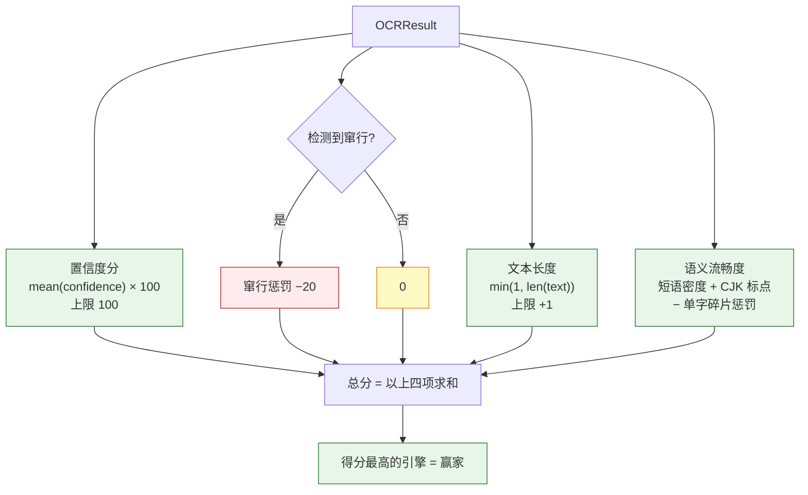

**语义流畅度(`_fluency_score`)打分信号**:

| 信号 | 分值范围 | 判定逻辑 |
|------|:----:|----------|
| 短语密度 | `0 ~ +15` | 每个区域平均字符数;句子越长越连贯 |
| CJK 标点比例 | `0 ~ +5` | `,。！？、；:()`等占比——有标点即像自然语言 |
| 单字碎片惩罚 | `0 ~ −25` | `len(text)==1` 的区域数 × 0.3——单字越多扣越多 |

> **对兰亭序实测**:rapidocr 输出 166 个单字/短词(fluency ≈ **−23**),
> 远程多模态输出完整古文句子(fluency ≈ **+15**)——`bestof-smart`/`bestof-fluency`
> 都能正确选中硅基流动。

**示例**:

```python
# 综合最优(推荐)
results = jykj_ocr.ocr("scan.png", strategy_name="bestof")

# 所有引擎各跑一次,按最快耗时选
results = jykj_ocr.ocr("scan.png", strategy_name="bestof-fastest")

# 冒号语法:等价于 bestof-fluency
results = jykj_ocr.ocr("scan.png", strategy_name="bestof:fluency")

# HTTP
curl -s http://localhost:8000/ocr/bestof \
  -F "file=@scan.png" -F "format=json"
curl -s http://localhost:8000/ocr/bestof-confidence/text \
  -H "Content-Type: application/json" \
  -d '{"image_url":"https://example.com/img.png","format":"text"}'
```

**`bestof` vs `seq*` 取舍**:

- `bestof` 比 `seq*` 慢(所有引擎都跑),但能拿到所有候选里最好的结果
- `seq*` 快(首个命中即返回),适合"引擎 A 大多数时候够用,偶尔才降级"的场景

### 9.4 底层重试模式(retry_mode)

所有 `seq*` 预设最终都落到 `retry_mode`。策略引擎按 `config.engines` 顺序尝试,
每个引擎最多重试 `max_retries` 次,由下列谓词决定是否换引擎:

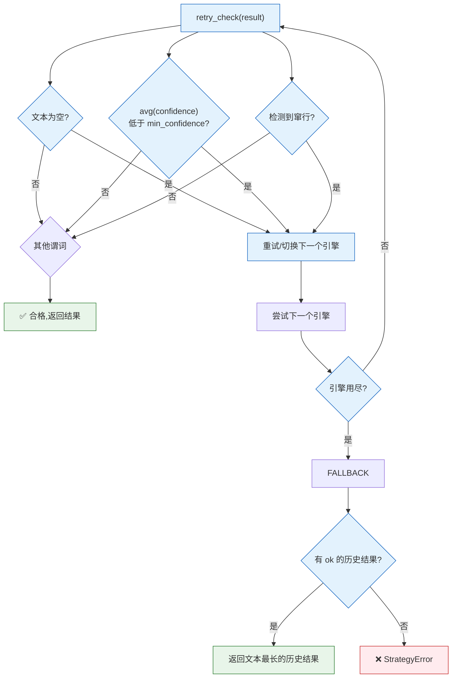

| `retry_mode` | 行为 |
|--------------|------|
| `no_text` | 结果无文本 → 重试/切换(**默认**) |
| `low_confidence` | 平均置信度 < `min_confidence` → 重试/切换 |
| `line_overlap` | 无文本**或**检测到窜行 → 重试/切换 |
| `any` | 低置信度**或**窜行任一命中 → 重试/切换(`combine_predicates` 组合) |
| `none` / `first_success` | 第一个成功结果即返回,不重试 |

**链耗尽兜底**:若所有引擎都失败或无文本,但某个引擎曾产出 `ok` 结果——返回其中**文本最长**的那个;若完全没有任何 `ok` 结果,抛 `StrategyError`(HTTP 422)。手动调参示例:

```bash
curl -s -X POST http://localhost:8000/config \
  -H "Content-Type: application/json" \
  -d '{"strategy":{"retry_mode":"any","min_confidence":0.75,"max_retries":2}}'
```

### 9.5 更多 OCR 引擎接入

本地/远程划分走 `remote_engines()`(内置 multimodal)。新注册引擎
**无需改代码**即被预设识别。要把新厂商归入远程侧:

```bash
export JYKJ_OCR_REMOTE_ENGINES="paddlecloud,acme-vl"   # 逗号分隔,小写
```

### 9.6 三种调用方式

所有预设都同时支持 CLI / HTTP / Python 三种入口,语义完全一致,可自由切换:

| 动作 | CLI | HTTP(multipart) | HTTP(JSON) | Python API |
|------|-----|------------------|------------|------------|
| 通用生产(seq,默认) | `ocr img.png` | `POST /ocr -F file=@img.png` | — | `ocr("img.png")` |
| 仅本地引擎 | `ocr --strategy-name local` | `POST /ocr/local -F file=@img.png` | — | `ocr("img.png", strategy_name="local")` |
| 窜行降级+重排(quality) | `ocr --strategy-name quality` | `POST /ocr/quality -F file=@img.png` | — | `ocr("img.png", strategy_name="quality")` |
| 级联:窜行直接上远程 | `ocr --strategy-name cascade-line_overlap` | `POST /ocr/cascade-line_overlap -F file=@img.png` | — | `ocr("img.png", strategy_name="cascade-line_overlap")` |
| 多引擎择优(smart) | `ocr --strategy-name bestof` | `POST /ocr/bestof -F file=@img.png` | — | `ocr("img.png", strategy_name="bestof")` |
| 按置信度择优 | `ocr --strategy-name bestof-confidence` | `POST /ocr/bestof-confidence -F file=@img.png` | — | `ocr("img.png", strategy_name="bestof-confidence")` |
| 冒号语法别名 | — | `POST /ocr/bestof:fluency -F file=@img.png` | `POST /ocr/bestof:fluency/text` | `ocr("img.png", strategy_name="bestof:fluency")` |
| 纯 URL 输入 | — | — | `POST /ocr/text -d '{"image_url":"..."}'` | `ocr("http://.../img.png")` |
| base64 输入 | — | — | `POST /ocr/text -d '{"image_b64":"..."}'` | `ocr("data:...;base64,...")` |

> **CLI 限制**:`--strategy-name` 参数只支持预设名本身(如 `bestof` / `quality`),
> **不支持** `bestof:<mode>` 冒号语法(argparse `choices` 的固有限制)。冒号语法
> 仅在 HTTP 和 Python API 下可用。
>
> **JSON body 三选一**:`image_url` / `image_b64` / `image_data` 只能传一个,
> 传零个或传多个都会返回 HTTP 400。

**路由即策略**:所有 `/ocr/{preset}` 路径自动识别 preset——
- preset 匹配已注册引擎名(`rapidocr`/`multimodal`):等价于强制单引擎
- preset 匹配策略预设名(`local`/`vl`/`seq*`/`cascade*`/`bestof*`/`fallback`/`quality`/`bestof:<mode>`):等价于 `strategy_name=preset`
- 其他值:HTTP 404 并列出所有可用引擎和预设名

**同一张图,从 CLI 到 HTTP 到 Python 的完整链路示例**:

```bash
# CLI:窜行降级 + 阅读顺序重排
python -m jykj_ocr stamp.png --strategy-name quality --format json

# HTTP multipart:等效行为
curl -s http://localhost:8000/ocr/quality \
  -F "file=@stamp.png" -F "format=json"

# HTTP JSON(纯 URL 输入):指定引擎 + 模型
curl -s http://localhost:8000/ocr/text \
  -H "Content-Type: application/json" \
  -d '{"image_url":"https://example.com/scan.png",
       "engine":"multimodal",
       "model":"PaddlePaddle/PaddleOCR-VL-1.5"}'
```

```python
import jykj_ocr

# 等价于 CLI 命令
results = jykj_ocr.ocr("stamp.png", strategy_name="quality")
print(results[0].text)

# 只拿纯文本(跳过 JSON 结构)
text = jykj_ocr.ocr_to_text("scan.png", engine="rapidocr")

# 指定 PDF 前 10 页,300 DPI
results = jykj_ocr.ocr("report.pdf", engine="rapidocr", max_pages=10, dpi=300)
```

### 9.7 使用场景速查

| 你的场景 | 推荐预设 | 建议模型 | 为什么 |
|----------|----------|----------|--------|
| 离线 / 隐私敏感 / 批量低成本 | `local` | `rapidocr`(本地 ONNX) | 不调用任何外部服务,零凭据,吞吐最高 |
| 版面复杂 / 手写 / 表格 / 盖章 | `vl` | `PaddleOCR-VL-1.5`(默认)/ `Qwen3-VL-30B-A3B-Instruct` | 本地必然崩的图就别先试 rapidocr;30B 会自动分段、排版最漂亮 |
| 通用生产(引擎 A 大多数时候够用) | `seq`(默认) / `fallback` | rapidocr → 快远程(`PaddleOCR-VL-1.5`) | 引擎 A 失败才降级,快且稳 |
| 盖章 / 倾斜导致 rapidocr 窜行 | `quality` / `seq-any` | rapidocr → `Qwen3-VL-30B-A3B-Instruct` | 窜行自动降级 + 按坐标重建阅读顺序 |
| 低置信度自动降级 | `seq-low_conf` | rapidocr → `Qwen3-VL-8B-Instruct` | 平均置信度低于 `min_confidence`(默认 0.7)才切换 |
| 只关心窜行(不在乎置信度) | `seq-line_overlap` | rapidocr → 任意远程 VL | 仅检测窜行触发降级 |
| 降级链路不想浪费时间 | `cascade-line_overlap` / `cascade` | 同上,但远程放快模型 | 同判定但 `max_retries=0`:本地窜行立刻上远程,不重扫同一张 |
| 远程偶发返回空 / 被限流 | `seq*` 而不是 `cascade*` | 任意 | 这种失败重试一次就好,不该直接降级 |
| 追求综合最优(推荐首选) | `bestof` / `bestof-smart` | rapidocr + `PaddleOCR-VL-1.5` + `Qwen3-VL-30B` | 所有引擎各跑一次,用置信度+流畅度+窜行惩罚综合打分 |
| 追求速度 | `local`,而不是 `bestof-fastest` | `rapidocr` | `fastest` 比的是耗时,远程抖动时赢家会变 |
| 追求逐字准确 | `bestof-confidence` | rapidocr + `PaddleOCR-VL-1.5` | 取平均置信度最高的结果(专用 OCR 模型置信度更可信) |
| 追求完整性,不漏字 | `bestof-smart`,而非 `bestof-longest` | 任意 | 碎片化输出也可能很长;`smart` 会惩罚它 |
| 追求"读起来像人话" | `bestof-fluency` | rapidocr + `Qwen3-VL-30B-A3B-Instruct` | 用短语密度+CJK 标点−单字碎片惩罚选最自然的结果 |
| 单次调用不能超时 | 任何 `seq*` / `cascade*` / `vl` | 任意 | bestof 串行,3 引擎最坏 = 3 × timeout |

> **对兰亭序实测**:rapidocr 输出 166 个单字(碎片化),远程多模态输出完整古文
> 句子——`bestof-smart`/`bestof-fluency` 能正确选中远程 VL。如果只关心"读起来
> 像人话",优先 `bestof-fluency`;如果对速度敏感,`seq`(默认)或 `seq-low_conf`
> 往往更快。模型类型与耗时对照见 §9.8。

> **调 `min_confidence` 实测**:`seq-low_conf` 默认阈值 0.7 时停在 rapidocr
> (488 字 / 9.7s,其平均置信度 0.91 > 0.7);`POST /config` 把阈值调到 0.95 后
> 立即降级到远程 VL(324 字 / 19.8s);`DELETE /config` 还原后回到 rapidocr。
> 阈值是运行时旋钮,不用改 yaml 也不用重启。

> **提示词(prompt)只对远程引擎生效**。`rapidocr` 完全忽略它——同一张图带与不带
> prompt 的 `rapidocr` 输出逐字节相同。所以给盖章 / 竖排 / 特殊版面写提示词,请把
> 引擎链放到远程侧(至少含一条 `multimodal`),或用 `strategy_name="vl"` 直连远程。


### 9.8 远程模型选型参考(实测数据,2026-09-05)

远端硅基流动上,视觉能力模型分三类:**OCR 专用**、**通用 VL**、**通用对话/
代码 Agent**。jykj_ocr 只适合前两类。同图(`tests/兰亭序.jpeg`,750×1390
繁体古文)直接调 `POST /v1/chat/completions` 的实测结果:

| Model | 类型 | HTTP | elapsed | 字符数 | 输出形态 | 结论 |
|---|---|:---:|---:|---:|---|---|
| `PaddlePaddle/PaddleOCR-VL-1.5` | OCR 专用 0.9B | 200 | **3.11s** | 352 | 全文,无分段 | ✅ 默认首选,速度最快 |
| `Qwen/Qwen3-VL-8B-Instruct` | 通用 VL 8B | 200 | 8.88s | 350 | 全文,自然分段 | ✅ 稳,做兜底 |
| `Qwen/Qwen3-VL-30B-A3B-Instruct` | MoE 30B/激活 3B | 200 | 11.96s | **360** | **自动分段**,排版最漂亮 | ✅ 文本整理最佳 |
| `Qwen/Qwen3-VL-32B-Instruct` | 通用 VL 32B | 200 | 1.48s | 4 | 拒识长文,只回 "OK" | ❌ 不做 OCR |
| `Qwen/Qwen3-VL-8B-Thinking` | 思考版 | 200 | 113.82s | 327 | 完整但慢 30× | ❌ 思考浪费 |
| `deepseek-ai/DeepSeek-OCR` | OCR 专用 3B | 200 | 2.25s | 128 | **乱码+截断**("ights'n]" 出现) | ❌ 输出崩坏 |
| `moonshotai/Kimi-K2.7-Code` | 代码 Agent | 200 | **157s** | 372 | 完整但**"墨趣"幻觉前缀** | ❌ 40× 慢+幻觉 |
| `Qwen/Qwen3-VL-14B-Instruct` | — | 400 | — | — | Siliconflow 未上架 | ❌ 不存在 |

**推荐组合**:
- **默认 OCR**:`PaddlePaddle/PaddleOCR-VL-1.5`(0.9B 专用,3 秒级)
- **文本整理**:`Qwen/Qwen3-VL-30B-A3B-Instruct`(自动分段、多语言、256K 上下文)
- **兜底**:`Qwen/Qwen3-VL-8B-Instruct`(dense 8B,与 30B 质量接近但更省)

**明确不推荐**:
- **`-Thinking` 后缀**:思考 tokens 占满延迟(113s+),OCR 任务不需要推理。
- **通用代码/对话 Agent 模型**(Kimi-K2.7-Code、GLM-4.5V 等):延迟高、
  带 `reasoning_content`、可能产生幻觉前缀。这些是 Agent 场景,不是 OCR 场景。
- **`Qwen3-VL-32B-Instruct`**:短 prompt 会拒识长文档(只回几个字),需要
  更长 prompt 引导才做 OCR,不划算。

**通用对话/代码模型为什么做不了 OCR**:它们把图片当作"要理解的对象",
优先回答指令;OCR 是需要"逐字识别+顺序输出"的机械任务,专用 OCR 模型
(PaddleOCR-VL-1.5 / DeepSeek-OCR)和专注视觉的 VL 模型(Qwen3-VL)
才在训练目标上对齐 OCR。

**bestof 与多模型的配合**:配好两个以上远程引擎后,`/ocr/bestof-fluency`
会同时跑它们并选"读起来最像人话"的输出——正好对应上表里"文本整理最佳"
那一档。`/ocr/bestof-fastest` 则会选最快,通常落在 PaddleOCR-VL-1.5。

### 9.9 全预设实测结果(2026-09-09)

部署:`http://192.168.0.81:8000`,3 引擎 = `rapidocr` + `PaddlePaddle/PaddleOCR-VL-1.5` +
`moonshotai/Kimi-K2.7-Code`。图片:`tests/兰亭序.jpeg`(750×1390 繁体古文)。
驱动脚本:`scripts/real_model_e2e.py`,35 项 **33 通过 / 2 SKIP / 0 失败**,总耗时
~1263s。

| 预设 | 期望行为 | 实测结果 | 耗时 | 判定 |
|------|----------|----------|-----:|------|
| `local` | 只用本地引擎 | `rapidocr`,488 字 | 8.9s | ✅ 未触发任何远程调用 |
| `vl` | 仅第 1 条已启用远程 | `PaddleOCR-VL-1.5`,324 字 | 2.5s | ✅ 选 Paddle 而非 Kimi——验证「保留 1 条远程」 |
| `seq` | 首个命中即返回(`no_text`) | `rapidocr`,488 字 | 9.7s | ✅ rapidocr 非空即通过 |
| `seq-any` | 窜行降级 + 按坐标重排 | `PaddleOCR-VL-1.5`,324 字 | 20.3s | ✅ rapidocr 被判窜行,降级生效 |
| `seq-low_conf` | 平均置信度 < `min_confidence`(0.7)才降级 | `rapidocr`,488 字 | 9.7s | ✅ rapidocr 置信度 0.91 > 0.7,不降级 |
| `seq-line_overlap` | 窜行降级 | `PaddleOCR-VL-1.5`,324 字 | 20.4s | ✅ |
| `cascade` | 同 seq,`max_retries=0` | `rapidocr`,488 字 | 10.1s | ✅ |
| `cascade-low_conf` | 同上 | `rapidocr`,488 字 | 9.0s | ✅ |
| `cascade-line_overlap` | 窜行**立刻**降级,不重试 | `PaddleOCR-VL-1.5`,324 字 | **11.0s** | ✅ 比 `seq-line_overlap`(20.4s)快 9.4s——差值正好是一次 rapidocr 重跑 |
| `fallback` | legacy 别名 == `seq` | `rapidocr`,488 字 | 10.2s | ✅ |
| `quality` | legacy 别名 == `seq-any` | `PaddleOCR-VL-1.5`,324 字 | 21.1s | ✅ |
| `bestof` / `bestof-smart` | 置信度 − 窜行 + 长度 + 流畅度 | `PaddleOCR-VL-1.5`,324 字 | 158.5s | ✅ 惩罚 rapidocr 的 166 个单字碎片 |
| `bestof-fastest` | `−elapsed_ms` | **`PaddleOCR-VL-1.5`**,324 字 | 148.4s | ✅ **赢家漂移**:Paddle 本次 ~2.5s 比 rapidocr ~9.7s 快。想稳定走本地请用 `local` |
| `bestof-confidence` | 平均置信度最高 | `PaddleOCR-VL-1.5`,324 字 | 195.8s | ✅ |
| `bestof-longest` | `len(text)` | **`rapidocr`**,488 字 | 113.4s | ✅ 488 > 324,长度取胜 |
| `bestof-fluency` | 短语密度 + CJK 标点 − 单字碎片惩罚 | `PaddleOCR-VL-1.5`,324 字 | 161.9s | ✅ |
| `bestof:smart` | 冒号语法别名 | `PaddleOCR-VL-1.5`,324 字 | 110.1s | ✅ |

**本轮观察**:

- **bestof 三个候选全部跑完,没有超时**。耗时 110~196s 主要由 Kimi 那 ~140s
  贡献,不是 Paddle。§9.3 的「超时那条进 `decision.errors` 而不是整体 502」机制
  本轮未触发,但曾抓到过——放在 bestof 链里的慢模型代价是每次调用都多等它。
- **`bestof-fastest` 的赢家变了**:本轮选的是远程 Paddle,不是 rapidocr。
  rapidocr 稳定在 ~9.7s,而远程 VL 抖动很大(实测见过 1.9s / 3.3s / 5.3s / 2.5s),
  某次远程恰好比本地快,赢家就翻过去了。§9.3 的警告是实测证据。
- **`cascade-line_overlap` 11.0s vs `seq-line_overlap` 20.4s**,差出的 9.4s
  就是那一次 rapidocr 重跑——本地对同一张图重扫不会变好。
- **`vl` 选的是 Paddle(第一条已启用的远程),不是 Kimi**。若两条远程都进
  `StrategyEngine` 的重试链,返回的模型会随重试结果漂移,不可预测——这正是 `vl`
  预设自己保证「只保留 1 条远程」的原因。
- **2 个 SKIP** 是 `image_url` 用例:该部署外网出口受限,服务端尝试下载公开图片
  URL 会拿到 SSL 握手超时 / 读超时,不能作为稳定输入源。`image_url` 由服务端解析,
  REST 客户端无法假定服务器文件系统上有测试图片,所以标 SKIP 而非 FAIL。远端跑
  请用 `JYKJ_OCR_REMOTE_IMAGE_URL` 指定服务端可达的 URL。

---

## 10. 常见问题

**Q: bestof 是针对某个引擎,还是所有 OCR 结果?**
A: 是针对**该页所有已启用引擎各跑一次后的候选结果**。`BestofEngine`
   与 `StrategyEngine` 是**并列**的两个 pipeline 组装目标
   (`build_pipeline` 看到 `strategy["bestof_mode"]` 就返回 `BestofEngine`,
   否则返回 `StrategyEngine`)——bestof 内部并**不**再包一层 strategy。
   `BestofEngine.recognise()` 对 `self._engines` **顺序**逐个
   `engine.recognise(image)` 调用(参考 `strategy.py:311-313`,`for engine
   in self._engines:` 是同步 for-loop,没有并发),对每个返回的 `OCRResult`
   跑一次 `score_fn` 打分,按分数降序排序后取第一个作为该页输出。
   多页 PDF 走的是"每页各选一次 bestof"的逻辑,不是"跨页合并后选"。
   参考 9.3 节的时序图:三条引擎分支顺序跑同一张图片,评分函数对每个
   `OCRResult` 独立打分。

**Q: 想固定用硅基流动,是不是该写 `name: siliconflow`?**
A: 不需要,也可以写。`siliconflow` 已降级为 `multimodal` 的别名:写
   `name: siliconflow` 与写 `name: multimodal` 现在完全等价,注册表里只有
   `rapidocr` 和 `multimodal` 两个引擎类型,返回结果里的 `engine` 字段一律是
   `multimodal`。平台由条目里的 `base_url` + `model` 决定,不是引擎名。
   建议直接写 `name: multimodal` 并把 `base_url` / `model` 显式写全——
   这样换平台只改这两行,不会踩到"这个引擎有没有内置默认"的分支。
   写多条 `name: multimodal` 时每条都是独立实例,由
   `(base_url, model, api_key)` 区分。

**Q: multimodal 报 "no base URL"?**
A: 没设 `OPENAI_BASE_URL` 且 config.yaml 中 multimodal 的 `base_url` 留空。multimodal
   不会自动回退到硅基流动(避免把别家 key 发到硅基流动),必须显式给 URL。

**Q: 远程引擎报 HTTP 402 / 余额不足?**
A: 账号余额不足,需充值。key 格式正确,请求已到达模型端点。

**Q: rapidocr 返回乱码或全是数字?**
A: `rapidocr-onnxruntime` 1.4.x 返回 `(results, elapsed)` 2-tuple,与 1.x 不同。
   已在 `_run()` 用 `_looks_like_results_list()` 适配;若升级到新大版本需检查返回形态。

**Q: 怎么换平台?**
A: 改 `OPENAI_BASE_URL` 与 `OPENAI_API_KEY` 两个环境变量,代码与配置不动。
   multimodal 引擎会自动走新端点。

**Q: 内存里的图片怎么识别?**
A: 先 `base64.b64encode(img_bytes).decode()` 后拼接为
   `data:image/png;base64,<payload>` 传入,或先写入临时文件再传路径。

**Q: API key 会被泄露吗?**
A: 不会。key 走环境变量(或 Docker `-e` 注入),不写入任何入库文件;`GET /config`
   只返回 `has_api_key` 布尔;运行时覆盖 `POST /config` 接受 `api_key` 字段但同样不回显明文。